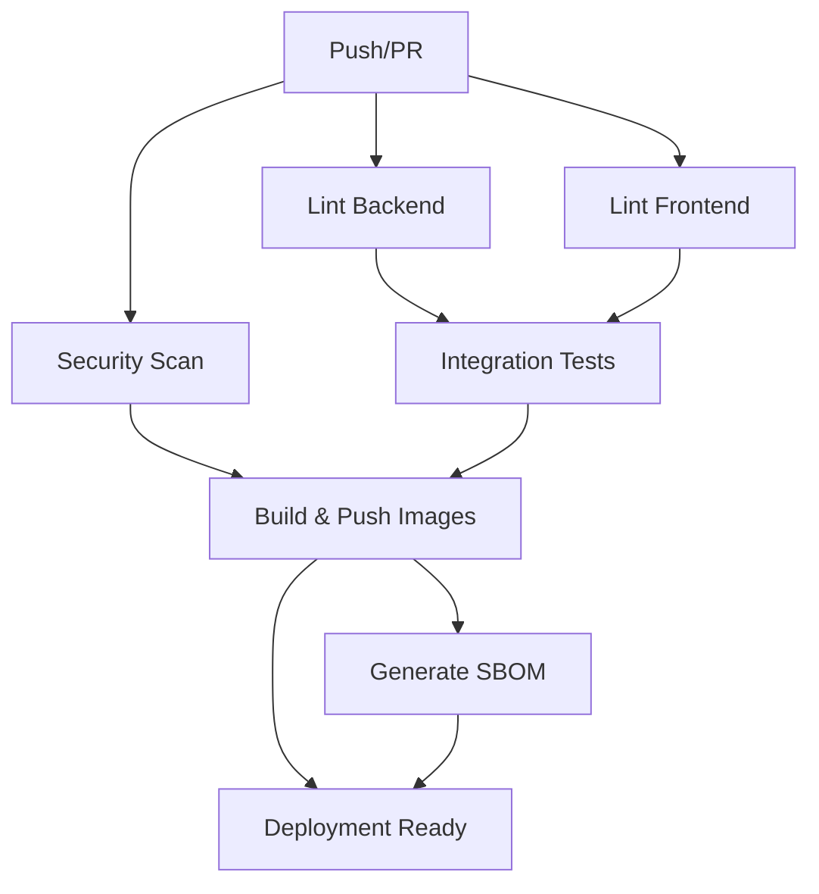

# 🚀 CI/CD Pipeline Documentation

This document describes the comprehensive CI/CD pipeline for the Secure Notes application, which includes linting, testing, building, security scanning, and automatic deployment to GitHub Container Registry.

## 🏗️ Pipeline Overview

The CI/CD pipeline is defined in `.github/workflows/build-and-deploy.yml` and consists of several jobs that run in parallel and sequence:



## 📋 Pipeline Jobs

### 1. 🔍 Backend Linting (`lint-backend`)
- **Purpose**: Validates Go code quality and runs tests
- **Tools**: 
  - `golangci-lint` with comprehensive ruleset (`.golangci.yml`)
  - Go race detector
  - Code coverage analysis
- **Outputs**: Coverage reports uploaded to Codecov
- **Triggers**: All pushes and PRs

### 2. 🔍 Frontend Linting (`lint-frontend`)
- **Purpose**: Validates React/TypeScript code quality
- **Tools**:
  - ESLint with TypeScript support
  - Prettier formatting check
  - TypeScript compilation check
  - Vitest unit tests with coverage
- **Outputs**: Coverage reports uploaded to Codecov
- **Triggers**: All pushes and PRs

### 3. 🛡️ Security Scanning (`security-scan`)
- **Purpose**: Identifies security vulnerabilities
- **Tools**:
  - Trivy filesystem scanner
  - Gosec static security analyzer
  - SARIF report generation
- **Outputs**: Security findings uploaded to GitHub Security tab
- **Triggers**: All pushes and PRs

### 4. 🧪 Integration Tests (`integration-tests`)
- **Purpose**: End-to-end testing with real services
- **Services**: PostgreSQL 15, Redis 7
- **Tests**:
  - Backend build and startup
  - Frontend build and compilation
  - API health checks
  - Database connectivity
  - Service integration
- **Requirements**: Passes only if all lint jobs succeed
- **Triggers**: All pushes and PRs

### 5. 🐳 Build & Push Images (`build-and-push`)
- **Purpose**: Builds and publishes Docker images to GHCR
- **Strategy**: Matrix build for backend and frontend
- **Features**:
  - Multi-platform builds (linux/amd64, linux/arm64)
  - Build caching with GitHub Actions cache
  - Semantic versioning with multiple tag strategies
  - Container metadata and labels
- **Registry**: GitHub Container Registry (`ghcr.io`)
- **Triggers**: Only on main/master branches and releases (not PRs from forks)

### 6. 📋 SBOM Generation (`generate-sbom`)
- **Purpose**: Creates Software Bill of Materials for compliance
- **Format**: SPDX JSON
- **Scope**: Both backend and frontend containers
- **Storage**: GitHub Artifacts and Release attachments
- **Triggers**: Only on main/master branches

### 7. 🚀 Deployment Ready (`deployment-ready`)
- **Purpose**: Provides deployment summary and release management
- **Features**:
  - Deployment summary with image tags and digests
  - GitHub release creation with SBOMs
  - Quick deployment instructions
- **Triggers**: Only on main/master branches and releases

## 🏷️ Container Image Tagging Strategy

Images are tagged with multiple strategies for flexibility:

| Trigger | Tag Examples |
|---------|-------------|
| Branch push | `main`, `develop` |
| Pull request | `pr-123` |
| Semantic release | `v1.2.3`, `1.2`, `1` |
| Git SHA | `main-abc1234` |
| Latest | `latest` (default branch only) |

## 🔧 Container Registry

Images are published to **GitHub Container Registry** (GHCR):

- **Backend**: `ghcr.io/your-org/your-repo/backend:tag`
- **Frontend**: `ghcr.io/your-org/your-repo/frontend:tag`

### Authentication
The pipeline uses the automatic `GITHUB_TOKEN` for authentication, which provides:
- Read access to repository contents
- Write access to packages for the same repository
- No manual setup required

## 🚀 Deployment Options

### Option 1: Using Pre-built Images (Recommended)

```bash
# Pull and deploy latest images
./deploy-from-ghcr.sh deploy

# Deploy specific version
VERSION=v1.2.3 ./deploy-from-ghcr.sh deploy

# Other commands
./deploy-from-ghcr.sh status  # Show status
./deploy-from-ghcr.sh logs    # View logs
./deploy-from-ghcr.sh stop    # Stop services
```

### Option 2: Docker Compose Override

```bash
# Use GHCR images instead of local builds
docker-compose -f docker-compose.yml -f docker-compose.ghcr.yml up -d
```

### Option 3: Manual Docker Commands

```bash
# Pull specific versions
docker pull ghcr.io/your-org/your-repo/backend:latest
docker pull ghcr.io/your-org/your-repo/frontend:latest

# Update your docker-compose.yml or deployment scripts
```

## 🛠️ Local Development

The CI/CD pipeline can be partially replicated locally:

### Backend Linting
```bash
cd backend
golangci-lint run --config .golangci.yml
go test -v -race -coverprofile=coverage.out ./...
```

### Frontend Linting
```bash
cd frontend
npm run lint
npm run format:check
npm run typecheck
npm run test:coverage
```

### Security Scanning
```bash
# Install Trivy
curl -sfL https://raw.githubusercontent.com/aquasecurity/trivy/main/contrib/install.sh | sh

# Scan filesystem
trivy fs .

# Scan images
trivy image ghcr.io/your-org/your-repo/backend:latest
```

### Local Build Test
```bash
# Test Docker builds
docker build -t test-backend ./backend
docker build -t test-frontend ./frontend
```

## 🔐 Security Features

### Code Scanning
- **Trivy**: Vulnerability scanning for dependencies and OS packages
- **Gosec**: Static security analysis for Go code
- **ESLint**: Security rules for JavaScript/TypeScript

### Container Security
- **Multi-stage builds**: Minimal attack surface
- **Non-root users**: Containers run as unprivileged users
- **Distroless images**: Reduced vulnerability footprint
- **SBOM generation**: Supply chain transparency

### Secrets Management
- Uses GitHub's automatic `GITHUB_TOKEN`
- No manual secret configuration required
- Secrets never exposed in logs or artifacts

## 📊 Monitoring and Observability

### Coverage Reports
- Automatic coverage collection for both backend and frontend
- Integration with Codecov for tracking coverage trends
- Coverage badges available for README

### Security Dashboard
- SARIF reports uploaded to GitHub Security tab
- Dependency vulnerability alerts
- Security advisory monitoring

### Build Artifacts
- Test results and coverage reports
- SBOM files for compliance
- Build logs and summaries

## 🔧 Configuration

### Required Repository Settings

1. **Enable GitHub Packages**:
   - Go to Settings → General → Features
   - Enable "Packages"

2. **Container Registry Permissions**:
   - Go to Package settings
   - Set visibility (public/private)
   - Configure access permissions

3. **Branch Protection** (Recommended):
   ```yaml
   Required status checks:
     - lint-backend
     - lint-frontend
     - security-scan
     - integration-tests
   ```

### Optional: External Integrations

#### Codecov Integration
1. Sign up at [codecov.io](https://codecov.io)
2. Add repository
3. Add `CODECOV_TOKEN` to repository secrets

#### Slack Notifications
Add to workflow file:
```yaml
- name: Slack Notification
  uses: 8398a7/action-slack@v3
  with:
    status: ${{ job.status }}
    webhook_url: ${{ secrets.SLACK_WEBHOOK }}
```

## 🐛 Troubleshooting

### Common Issues

#### 1. **Permission Denied for GHCR**
- Ensure `packages: write` permission in job
- Verify `GITHUB_TOKEN` has correct scopes
- Check repository package settings

#### 2. **Build Failures**
- Check individual job logs
- Verify all linting passes locally first
- Ensure all tests pass with real services

#### 3. **Image Pull Failures**
- Verify image exists in registry
- Check image visibility settings
- Ensure correct repository name in tags

#### 4. **Integration Test Failures**
- Services may need more time to start
- Check service health in workflow
- Verify environment variables

### Debugging Commands

```bash
# Check workflow status
gh run list --workflow="Build, Test & Deploy"

# View specific run
gh run view <run-id>

# Check package status
gh api repos/:owner/:repo/packages

# Test deployment locally
docker-compose -f docker-compose.yml -f docker-compose.ghcr.yml config
```

## 📈 Metrics and Analytics

### Pipeline Metrics
- Build success rate
- Test coverage trends
- Security vulnerability counts
- Build duration trends

### Container Metrics
- Image size trends
- Pull statistics
- Version adoption rates

### Deployment Metrics
- Deployment frequency
- Lead time for changes
- Mean time to recovery

---

## 🎯 Next Steps

1. **Set up monitoring**: Add application performance monitoring
2. **Implement staging**: Add staging environment deployment
3. **Add E2E tests**: Browser-based end-to-end testing
4. **Performance testing**: Load testing in CI pipeline
5. **Infrastructure as Code**: Terraform or similar for cloud deployment

This CI/CD pipeline provides a robust foundation for secure, automated software delivery while maintaining high code quality and security standards.