# 📋 Versioning and Release Management

This document explains how to create new versions and releases for the Secure Notes application.

## 🏷️ Versioning Strategy

We use **Semantic Versioning (SemVer)** following the format: `MAJOR.MINOR.PATCH[-PRERELEASE]`

- **MAJOR** (1.0.0 → 2.0.0): Breaking changes, incompatible API changes
- **MINOR** (1.0.0 → 1.1.0): New features, backwards compatible
- **PATCH** (1.0.0 → 1.0.1): Bug fixes, backwards compatible
- **PRERELEASE** (1.0.0 → 1.0.1-rc.20241201120000): Pre-release versions

### Version Examples
```
v1.0.0       - Initial stable release
v1.0.1       - Patch release (bug fixes)
v1.1.0       - Minor release (new features)  
v2.0.0       - Major release (breaking changes)
v1.1.0-rc.1  - Release candidate (prerelease)
```

## 🚀 Release Methods

### Method 1: Local Script (Recommended)

The easiest way to create releases using the local script:

```bash
# Patch release (1.0.0 → 1.0.1)
./scripts/release.sh patch

# Minor release with custom notes  
./scripts/release.sh minor --notes "Added user preferences and dark mode"

# Major release with preview
./scripts/release.sh major --dry-run

# Prerelease version
./scripts/release.sh prerelease

# Custom version
./scripts/release.sh custom --version "2.0.0-beta.1"
```

#### Script Options:
- `--dry-run`: Preview changes without executing
- `--notes "text"`: Add custom release notes
- `--skip-tests`: Skip pre-release tests (use with caution)
- `--version X.Y.Z`: Specify exact version (with custom type)

### Method 2: GitHub Actions Web Interface

1. Go to **Actions** tab in your repository
2. Select **🚀 Release Management** workflow  
3. Click **Run workflow**
4. Choose options:
   - **Version bump type**: patch, minor, major, prerelease
   - **Custom version** (optional): Override version calculation
   - **Release notes** (optional): Custom description
   - **Skip tests**: Only for emergency releases

### Method 3: GitHub CLI

```bash
# Trigger release workflow with gh CLI
gh workflow run release.yml \
  --field version_type=minor \
  --field release_notes="Added new features and improvements"

# With custom version
gh workflow run release.yml \
  --field version_type=custom \
  --field custom_version="2.0.0" \
  --field release_notes="Major release with breaking changes"
```

## 📦 Container Image Versioning

Each release creates multiple container image tags:

| Release Type | Example Tags Created |
|--------------|---------------------|
| **v1.2.3 (Stable)** | `v1.2.3`, `1.2.3`, `1.2`, `1`, `latest` |
| **v1.2.3-rc.1 (Prerelease)** | `v1.2.3-rc.1`, `1.2.3-rc.1` |
| **Branch Push** | `main`, `develop` |
| **Pull Request** | `pr-123` |

### Pulling Specific Versions

```bash
# Latest stable release
docker pull ghcr.io/your-org/your-repo/backend:latest

# Specific version
docker pull ghcr.io/your-org/your-repo/backend:v1.2.3

# Major version (automatically updated)
docker pull ghcr.io/your-org/your-repo/backend:1

# Prerelease
docker pull ghcr.io/your-org/your-repo/backend:v1.2.3-rc.1
```

## 🔄 Release Process Flow

```mermaid
graph TB
    A[Developer initiates release] --> B[Version calculation]
    B --> C[Generate changelog]
    C --> D[Run pre-release tests]
    D --> E{Tests pass?}
    E -->|No| F[Fix issues & restart]
    E -->|Yes| G[Create Git tag]
    G --> H[Create GitHub Release]
    H --> I[Trigger container builds]
    I --> J[Generate SBOM]
    J --> K[Update version files]
    K --> L[Create version bump PR]
    L --> M[Release complete! 🎉]
```



### What Happens During a Release:

1. **📊 Version Calculation**: Determines next version based on type
2. **📝 Changelog Generation**: Auto-generates from Git commits  
3. **🧪 Pre-release Tests**: Runs full test suite (unless skipped)
4. **🏷️ Tag Creation**: Creates and pushes Git tag
5. **📋 GitHub Release**: Creates release with changelog
6. **🐳 Container Build**: Triggers image build workflow
7. **📋 SBOM Generation**: Creates Software Bill of Materials
8. **🔖 Version Bump**: Updates package.json and creates PR

## 🎯 Release Guidelines

### When to Release

#### **Patch Releases (1.0.0 → 1.0.1)**
- 🐛 Bug fixes
- 🔒 Security patches  
- 📝 Documentation updates
- 🧹 Minor refactoring (no API changes)

#### **Minor Releases (1.0.0 → 1.1.0)**
- ✨ New features (backwards compatible)
- 🚀 Performance improvements
- 🔧 New configuration options
- 📦 Dependency updates

#### **Major Releases (1.0.0 → 2.0.0)**
- 💥 Breaking changes
- 🔄 API modifications
- 🏗️ Architecture changes
- 🗑️ Deprecated feature removal

#### **Prereleases (1.0.0 → 1.0.1-rc.1)**
- 🧪 Beta testing
- 🔍 Feature validation
- 📊 Performance testing
- 🤝 Stakeholder review

### Release Checklist

Before creating a release, ensure:

- [ ] **All tests pass** locally and in CI
- [ ] **Documentation updated** for new features
- [ ] **Breaking changes documented** in major releases
- [ ] **Security vulnerabilities addressed**
- [ ] **Performance regressions investigated**
- [ ] **Database migrations tested** (if applicable)
- [ ] **Rollback plan prepared** for major releases

## 🚀 Deployment After Release

### Automatic Deployment (Recommended)

Use the deployment script with the new version:

```bash
# Deploy latest release
./deploy-from-ghcr.sh deploy

# Deploy specific version  
VERSION=v1.2.3 ./deploy-from-ghcr.sh deploy

# Check deployment status
./deploy-from-ghcr.sh status
```

### Manual Deployment

```bash
# Update docker-compose to use specific version
export VERSION=v1.2.3
docker-compose -f docker-compose.yml -f docker-compose.ghcr.yml pull
docker-compose -f docker-compose.yml -f docker-compose.ghcr.yml up -d

# Verify deployment
curl http://localhost:8080/api/v1/health
```

### Kubernetes Deployment

If using Kubernetes, update your manifests:

```yaml
# Update image tags in your deployment
apiVersion: apps/v1
kind: Deployment
metadata:
  name: secure-notes-backend
spec:
  template:
    spec:
      containers:
      - name: backend
        image: ghcr.io/your-org/your-repo/backend:v1.2.3
```

## 🔧 Configuration

### Required Repository Settings

1. **Actions Permissions**:
   - Settings → Actions → General
   - Enable "Read and write permissions" for GITHUB_TOKEN
   - Allow "Create and approve pull requests"

2. **Branch Protection** (Recommended):
   ```yaml
   main/master branch:
     - Require pull request reviews
     - Require status checks to pass
     - Required checks: lint-backend, lint-frontend, integration-tests
     - Restrict pushes to matching branches
   ```

3. **Package Settings**:
   - Go to package settings in GitHub
   - Set appropriate visibility (public/private)
   - Configure access permissions

### Optional Integrations

#### Slack Notifications

Add to your workflow to get release notifications:

```yaml
- name: Slack Notification
  if: success()
  uses: 8398a7/action-slack@v3
  with:
    status: success
    text: "🎉 Released ${{ needs.version-calculation.outputs.next_version }}"
    webhook_url: ${{ secrets.SLACK_WEBHOOK }}
```

#### Email Notifications

GitHub can send email notifications for releases:
- Repository Settings → Notifications
- Enable "Releases" notifications

## 📊 Release Analytics

Track your release metrics:

### Frequency Metrics
- **Release frequency**: How often you release
- **Lead time**: Time from feature completion to release
- **Hotfix frequency**: Number of patch releases

### Quality Metrics  
- **Release success rate**: Releases without rollbacks
- **Test coverage**: Code coverage trends
- **Security score**: Vulnerability resolution time

### Adoption Metrics
- **Image pull statistics**: Usage of different versions
- **Version distribution**: Which versions are deployed
- **Update lag**: Time to adopt new releases

## 🐛 Troubleshooting Releases

### Common Issues

#### 1. **Release Workflow Fails**
```bash
# Check workflow logs
gh run list --workflow="release.yml" --limit=5
gh run view <run-id>

# Common fixes:
- Ensure no uncommitted changes
- Check branch protection rules  
- Verify GITHUB_TOKEN permissions
```

#### 2. **Container Build Fails**
```bash
# Check build workflow
gh run list --workflow="build-and-deploy.yml" --limit=5

# Debug locally:
docker build -t test-backend ./backend
docker build -t test-frontend ./frontend
```

#### 3. **Tag Already Exists**
```bash
# List existing tags
git tag -l

# Delete local and remote tag if needed (DANGEROUS)
git tag -d v1.2.3
git push origin :refs/tags/v1.2.3
```

#### 4. **Permission Denied**
- Check repository settings → Actions → General
- Ensure "Read and write permissions" enabled
- Verify you have admin access to repository

### Emergency Rollback

If a release causes issues:

```bash
# Deploy previous version
VERSION=v1.2.2 ./deploy-from-ghcr.sh deploy

# Or use Docker directly
docker-compose -f docker-compose.yml -f docker-compose.ghcr.yml down
export VERSION=v1.2.2
docker-compose -f docker-compose.yml -f docker-compose.ghcr.yml up -d
```

## 🎯 Best Practices

### 1. **Release Naming**
- Use descriptive release names: "🚀 Release v1.2.0"
- Include emojis for visual distinction
- Mention key features in title

### 2. **Release Notes**
- **What's New**: List major features/changes
- **Bug Fixes**: Document fixed issues
- **Breaking Changes**: Highlight incompatibilities  
- **Upgrade Instructions**: How to migrate
- **Known Issues**: Acknowledge limitations

### 3. **Testing Strategy**
- **Unit Tests**: Test individual components
- **Integration Tests**: Test service interactions
- **End-to-End Tests**: Test complete user flows
- **Security Tests**: Verify no new vulnerabilities
- **Performance Tests**: Ensure no regressions

### 4. **Release Timing**
- **Avoid Fridays**: Releases need monitoring
- **Business Hours**: Team available for issues
- **Low Traffic**: Minimize user impact
- **After Testing**: Full QA cycle completion

### 5. **Communication**
- **Advance Notice**: Announce planned releases
- **Stakeholder Updates**: Inform relevant teams
- **User Communication**: Notify of breaking changes
- **Documentation**: Update user guides

---

## 📚 Additional Resources

- [Semantic Versioning Specification](https://semver.org/)
- [GitHub Releases Documentation](https://docs.github.com/en/repositories/releasing-projects-on-github)
- [Container Registry Documentation](https://docs.github.com/en/packages/working-with-a-github-packages-registry/working-with-the-container-registry)
- [GitHub Actions Workflows](https://docs.github.com/en/actions/using-workflows)

Ready to create your first release? Start with:
```bash
./scripts/release.sh patch --dry-run
```

This will show you exactly what would happen without making any changes! 🚀