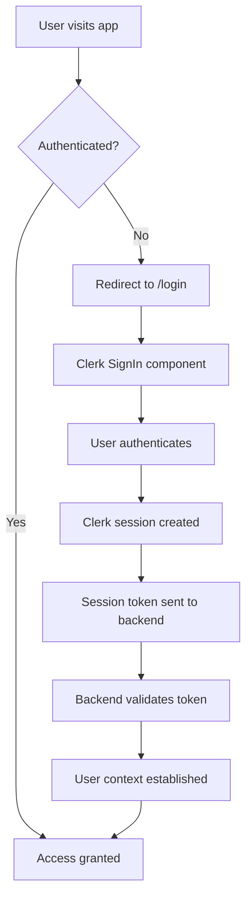

import { Tabs, TabItem } from '@astrojs/starlight/components';

LeafLock now uses [Clerk](https://clerk.com) for modern, secure authentication. This integration provides enterprise-grade authentication features while maintaining LeafLock's zero-knowledge architecture.

## Overview

Clerk replaces LeafLock's custom JWT-based authentication with a professional authentication service that offers:

- **Modern Authentication**: Email/password, social logins, magic links, passkeys
- **Enterprise Security**: Automatic breach detection, bot protection, rate limiting
- **User Management**: Admin dashboards, user impersonation, analytics
- **Compliance**: GDPR, SOC 2, HIPAA compliance built-in
- **Developer Experience**: Pre-built components, type safety, excellent documentation

## Architecture

### Authentication Flow



### Dual Authentication Support

During migration, LeafLock supports both authentication methods:

- **Clerk Authentication**: New users and gradual migration
- **Legacy JWT**: Existing users continue working during transition
- **Automatic Detection**: Backend intelligently handles both token types

## Configuration

### Environment Variables

<Tabs>
<TabItem label="Required">
```bash
# Clerk Authentication
CLERK_PUBLISHABLE_KEY=pk_test_your_key_here
CLERK_SECRET_KEY=sk_test_your_key_here
VITE_CLERK_PUBLISHABLE_KEY=pk_test_your_key_here

# Registration Control
VITE_ENABLE_REGISTRATION=true
```
</TabItem>
<TabItem label="Optional">
```bash
# Clerk Customization
CLERK_SIGN_IN_URL=/login
CLERK_SIGN_UP_URL=/register
CLERK_AFTER_SIGN_IN_URL=/
CLERK_AFTER_SIGN_UP_URL=/
```
</TabItem>
</Tabs>

### Getting Clerk Keys

1. **Create Clerk Account**
   - Visit [Clerk Dashboard](https://dashboard.clerk.com)
   - Sign up for a free account

2. **Create Application**
   - Click "Create Application"
   - Name it "LeafLock" or your preferred name
   - Select "React" as the framework

3. **Copy Keys**
   - Go to "API Keys" in the sidebar
   - Copy both the **Publishable Key** and **Secret Key**
   - Add them to your environment variables

## Implementation Details

### Frontend Integration

#### App Configuration
The main App component wraps the application with ClerkProvider:

```tsx
import { ClerkProvider } from '@clerk/clerk-react'

function App() {
  return (
    <ClerkProvider
      publishableKey={import.meta.env.VITE_CLERK_PUBLISHABLE_KEY}
      afterSignOutUrl="/login"
      signInUrl="/login"
      signUpUrl="/register"
    >
      {/* Your app content */}
    </ClerkProvider>
  )
}
```

#### Authentication Components
LeafLock uses Clerk's pre-built components with custom theming:

```tsx
import { SignIn, SignUp } from '@clerk/clerk-react'

// Login page
<SignIn
  routing="path"
  path="/login"
  appearance={{
    elements: {
      rootBox: 'mx-auto',
      card: 'bg-background/95 backdrop-blur supports-[backdrop-filter]:bg-background/60',
      headerTitle: 'text-foreground',
      headerSubtitle: 'text-muted-foreground',
      // ... more theme customization
    },
  }}
/>
```

#### API Integration
API calls automatically include Clerk session tokens:

```tsx
import { useSession } from '@clerk/clerk-react'

function ApiComponent() {
  const { getToken } = useSession()
  
  const fetchData = async () => {
    const token = await getToken()
    const response = await fetch('/api/data', {
      headers: {
        'Authorization': `Bearer ${token}`
      }
    })
    // Handle response
  }
}
```

### Backend Integration

#### Middleware Configuration
The backend uses dual authentication middleware:

```go
// Supports both JWT and Clerk tokens
protected := api.Group("", authHandler.DualAuthMiddleware)
```

#### Clerk Token Validation
Clerk tokens are validated using the Clerk SDK:

```go
func (h *Handler) validateClerkToken(ctx context.Context, token string) (*jwt.Claims, error) {
    claims, err := jwt.Verify(ctx, &jwt.VerifyParams{
        Token: token,
    })
    return claims, err
}
```

#### User Context
Both authentication methods provide consistent user context:

```go
// Works with both JWT and Clerk
userID := c.Locals("user_id").(uuid.UUID)
isAdmin := c.Locals("is_admin").(bool)
```

## Features

### Authentication Methods
- **Email/Password**: Traditional email and password authentication
- **Social Logins**: Google, GitHub, Facebook, and more
- **Magic Links**: Passwordless email authentication
- **One-Time Codes**: SMS and email verification codes
- **Passkeys**: Modern passwordless authentication

### Security Features
- **Automatic Breach Detection**: Checks passwords against known breaches
- **Bot Protection**: Advanced bot detection and prevention
- **Rate Limiting**: Built-in protection against brute force attacks
- **Session Management**: Secure session handling with automatic refresh
- **Multi-Factor Authentication**: TOTP, SMS, and backup codes

### User Management
- **Admin Dashboard**: Web interface for user management
- **User Profiles**: Customizable user profiles and settings
- **Role Management**: Built-in role and permission system
- **Analytics**: User engagement and security metrics
- **User Impersonation**: Support for customer service scenarios

## Migration from JWT

### Dual Authentication Period
During migration, both authentication methods work simultaneously:

1. **Existing Users**: Continue using JWT tokens
2. **New Users**: Use Clerk authentication
3. **Gradual Migration**: Users can be migrated over time
4. **Zero Downtime**: No service interruption

### Migration Strategy

<Tabs>
<TabItem label="Phase 1: Dual Auth (Current)">
- Both JWT and Clerk tokens accepted
- Existing users unaffected
- New users get modern auth
- Backend handles both seamlessly
</TabItem>

<TabItem label="Phase 2: User Migration">
- Map existing users to Clerk profiles
- Handle password resets gracefully
- Maintain user data integrity
- Preserve encryption keys
</TabItem>

<TabItem label="Phase 3: Cleanup">
- Remove JWT authentication entirely
- Clean up legacy auth code
- Update documentation
- Archive old system
</TabItem>
</Tabs>

## Customization

### Theming
Clerk components are fully customizable to match LeafLock's design:

```tsx
appearance={{
  elements: {
    // Layout
    rootBox: 'mx-auto max-w-md',
    card: 'bg-background border-border shadow-lg',
    
    // Typography
    headerTitle: 'text-2xl font-bold text-foreground',
    headerSubtitle: 'text-muted-foreground',
    
    // Form elements
    formFieldLabel: 'text-foreground font-medium',
    formFieldInput: 'bg-background border-border text-foreground',
    
    // Buttons
    socialButtonsBlockButton: 'bg-background border-border hover:bg-accent',
    formButtonPrimary: 'bg-primary text-primary-foreground hover:bg-primary/90',
    
    // Links
    footerActionText: 'text-muted-foreground',
    footerActionLink: 'text-primary hover:text-primary/90',
  },
  variables: {
    colorPrimary: '#3b82f6',
    colorBackground: '#0f172a',
    colorText: '#f8fafc',
  },
}}
```

### Custom Pages
You can create completely custom authentication flows:

```tsx
import { useSignIn } from '@clerk/clerk-react'

function CustomSignIn() {
  const { signIn, isLoaded } = useSignIn()
  
  const handleSubmit = async (e: FormEvent) => {
    e.preventDefault()
    await signIn.create({
      identifier: email,
      password: password,
    })
  }
  
  return <form onSubmit={handleSubmit}>{/* Custom form */}</form>
}
```

## Troubleshooting

### Common Issues

#### "Invalid Clerk token"
- Verify `CLERK_SECRET_KEY` is correct
- Check token hasn't expired
- Ensure backend can reach Clerk API

#### "User not found"
- Map Clerk user ID to internal user ID
- Check user migration status
- Verify database connections

#### "Authentication failed"
- Check environment variables
- Verify Clerk application settings
- Review middleware configuration

### Debug Mode
Enable debug logging:
```bash
LOG_LEVEL=debug npm run dev
```

### Testing Authentication
```bash
# Start development server
npm run dev

# Test authentication
open http://localhost:3000/login

# Check browser console for Clerk logs
```

## Performance

### Optimization Features
- **Lazy Loading**: Authentication components load on demand
- **Token Caching**: Session tokens cached locally
- **CDN Delivery**: Clerk components served from CDN
- **Tree Shaking**: Unused code eliminated from bundle

### Bundle Size Impact
- **Added**: ~45KB for Clerk React SDK
- **Removed**: ~180KB of custom auth code
- **Net Reduction**: ~135KB smaller bundle

## Compliance

### Data Protection
- **GDPR Compliant**: Built-in privacy controls
- **Data Export**: Easy user data export
- **Right to Deletion**: User account deletion support
- **Audit Logs**: Comprehensive activity tracking

### Security Standards
- **SOC 2 Type 2**: Regular security audits
- **HIPAA Ready**: Available with BAA
- **ISO 27001**: Information security management
- **Regular Penetration Testing**: Ongoing security validation

## Support

### Clerk Resources
- 📚 [Clerk Documentation](https://clerk.com/docs)
- 💬 [Clerk Discord Community](https://clerk.com/discord)
- 🎥 [Clerk YouTube Channel](https://www.youtube.com/c/ClerkDev)
- 📧 [Clerk Support](https://clerk.com/support)

### LeafLock Integration
- Check existing [GitHub Issues](https://github.com/RelativeSure/LeafLock/issues)
- Review [implementation details](./implementation.mdx)
- Test with [development setup](./development.mdx)

## Next Steps

1. **Get Started**: Follow the [Quick Start Guide](./quick-start.mdx)
2. **Configure**: Set up your [environment variables](./configuration.mdx)
3. **Customize**: [Theme your authentication](./customization.mdx)
4. **Migrate**: Plan your [user migration strategy](./migration.mdx)

---

Experience modern, secure authentication with Clerk and LeafLock! 🔐