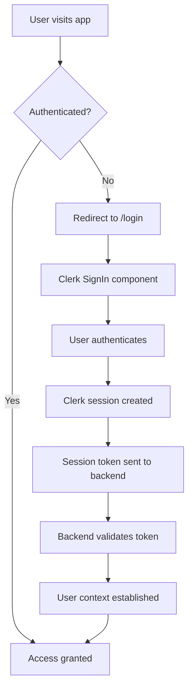
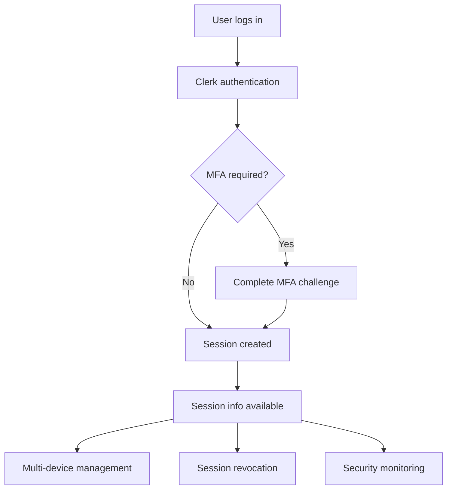

import { Tabs, TabItem } from '@astrojs/starlight/components';

LeafLock now uses [Clerk](https://clerk.com) for modern, secure authentication. This integration provides enterprise-grade authentication features while maintaining LeafLock's zero-knowledge architecture.

## Overview

Clerk replaces LeafLock's custom JWT-based authentication with a professional authentication service that offers:

- **Modern Authentication**: Email/password, social logins, magic links, passkeys
- **Enterprise Security**: Automatic breach detection, bot protection, rate limiting
- **User Management**: Admin dashboards, user impersonation, analytics
- **Compliance**: GDPR, SOC 2, HIPAA compliance built-in
- **Developer Experience**: Pre-built components, type safety, excellent documentation

## Advanced Features Available

### Enhanced Session Management
- **Multi-device sessions**: Users can manage sessions across devices
- **Session revocation**: "Log out of other devices" functionality
- **Detailed session info**: IP addresses, device information, last active times
- **Advanced session security**: Automatic session expiration, suspicious activity detection

### Enterprise MFA Features
- **Multiple authentication methods**: TOTP, SMS, email codes, backup codes
- **Risk-based authentication**: Adaptive MFA based on login patterns
- **Organization-level MFA**: Enforce MFA for entire organizations
- **Custom MFA policies**: Role-based and conditional MFA requirements

### Organization Management
- **Multi-tenant support**: Organization-based user management
- **Role-based access**: Admin, member, and custom roles
- **Organization switching**: Users can belong to multiple organizations
- **Domain-based enrollment**: Automatic organization membership

### Advanced Security Features
- **Social login integration**: Google, GitHub, Microsoft, Facebook, Twitter
- **SAML SSO**: Enterprise single sign-on support
- **SCIM provisioning**: Automated user lifecycle management
- **Advanced threat detection**: Bot protection, breach detection, anomaly detection

## Architecture

### Authentication Flow



### Advanced Session Flow



### Dual Authentication Support

During migration, LeafLock supports both authentication methods:

- **Clerk Authentication**: New users and gradual migration
- **Legacy JWT**: Existing users continue working during transition
- **Automatic Detection**: Backend intelligently handles both token types

## Configuration

### Environment Variables

<Tabs>
  <TabItem label="Required">
```bash
# Clerk Authentication
CLERK_PUBLISHABLE_KEY=pk_test_your_key_here
CLERK_SECRET_KEY=sk_test_your_key_here
VITE_CLERK_PUBLISHABLE_KEY=pk_test_your_key_here

# Registration Control
VITE_ENABLE_REGISTRATION=true
```
</TabItem>
  
  <TabItem label="Optional">
```bash
# Clerk Customization
CLERK_SIGN_IN_URL=/login
CLERK_SIGN_UP_URL=/register
CLERK_AFTER_SIGN_IN_URL=/
CLERK_AFTER_SIGN_UP_URL=/
```
</TabItem>
</Tabs>

### Advanced Configuration Options

For enterprise deployments, additional configuration options are available:

```bash
# Organization Management
CLERK_ORGANIZATION_MAX_MEMBERS=100
CLERK_ORGANIZATION_DOMAINS="yourcompany.com,yourorg.org"

# Security Settings
CLERK_SESSION_MAX_AGE=604800  # 7 days
CLERK_MFA_ENFORCEMENT=optional  # optional, required, conditional
CLERK_SOCIAL_LOGIN_PROVIDERS="google,github,microsoft"

# Enterprise Features
CLERK_SAML_ENABLED=true
CLERK_SCIM_ENABLED=true
CLERK_AUDIT_LOG_RETENTION=90  # days
```

### Getting Clerk Keys

1. **Create Clerk Account**
   - Visit [Clerk Dashboard](https://dashboard.clerk.com)
   - Sign up for a free account

2. **Create Application**
   - Click "Create Application"
   - Name it "LeafLock" or your preferred name
   - Select "React" as the framework

3. **Copy Keys**
   - Go to "API Keys" in the sidebar
   - Copy both the **Publishable Key** and **Secret Key**
   - Add them to your environment variables

## Implementation Details

### Frontend Integration

#### App Configuration
The main App component wraps the application with ClerkProvider:

```tsx
import { ClerkProvider } from '@clerk/clerk-react'

function App() {
  return (
    <ClerkProvider
      publishableKey={import.meta.env.VITE_CLERK_PUBLISHABLE_KEY}
      afterSignOutUrl="/login"
      signInUrl="/login"
      signUpUrl="/register"
    >
      {/* Your app content */}
    </ClerkProvider>
  )
}
```

#### Enhanced Authentication Components
LeafLock uses Clerk's pre-built components with advanced theming:

```tsx
import { SignIn, SignUp } from '@clerk/clerk-react'

// Advanced themed SignIn component
<SignIn
  routing="path"
  path="/login"
  appearance={{
    elements: {
      // Layout
      rootBox: 'mx-auto max-w-md',
      card: 'bg-background/95 backdrop-blur supports-[backdrop-filter]:bg-background/60',
      
      // Typography
      headerTitle: 'text-2xl font-bold text-foreground',
      headerSubtitle: 'text-muted-foreground',
      
      // Form elements
      formFieldLabel: 'text-foreground font-medium',
      formFieldInput: 'bg-background border-border text-foreground',
      
      // Buttons
      socialButtonsBlockButton: 'bg-background border-border hover:bg-accent',
      formButtonPrimary: 'bg-primary text-primary-foreground hover:bg-primary/90',
      
      // Links
      footerActionText: 'text-muted-foreground',
      footerActionLink: 'text-primary hover:text-primary/90',
    },
    variables: {
      colorPrimary: '#3b82f6',
      colorBackground: '#0f172a',
      colorText: '#f8fafc',
    },
  }}
/>
```

#### API Integration with Enhanced Features
API calls automatically include Clerk session tokens with advanced features:

```tsx
import { useSession } from '@clerk/clerk-react'

function ApiComponent() {
  const { getToken } = useSession()
  
  const fetchData = async () => {
    const token = await getToken()
    const response = await fetch('/api/data', {
      headers: {
        'Authorization': `Bearer ${token}`
      }
    })
    // Enhanced error handling and token refresh
    return response.json()
  }
}
```

#### Advanced Session Management Hook
Enhanced Clerk hooks with additional functionality:

```tsx
import { useEnhancedClerk } from '@/hooks/useEnhancedClerk'

function UserProfile() {
  const { user, session, isLoaded, checkSessionExpiry } = useEnhancedClerk()
  
  // Advanced session monitoring
  useEffect(() => {
    checkSessionExpiry()
  }, [])
  
  return <div>Welcome {user?.firstName}!</div>
}
```

### Backend Integration

#### Enhanced Middleware Configuration
The backend uses dual authentication middleware with advanced security:

```go
// Supports both JWT and Clerk tokens with enhanced security
protected := api.Group("", authHandler.DualAuthMiddleware)

// Clerk-specific routes for advanced features
clerkEnhanced := protected.Group("/clerk")
clerkEnhanced.Get("/session/info", authHandler.GetClerkSessionInfo)
clerkEnhanced.Get("/sessions", authHandler.GetClerkSessions)
clerkEnhanced.Post("/sessions/:sessionId/revoke", authHandler.RevokeClerkSession)
```

#### Advanced Token Validation
Clerk tokens are validated using the Clerk SDK with enhanced security:

```go
// Enhanced token validation with timing attack protection
func (h *Handler) validateClerkTokenEnhanced(ctx context.Context, token string) (*jwt.Claims, error) {
    // Add timing attack protection
    h.TimingAttackProtection()
    
    claims, err := jwt.Verify(ctx, &jwt.VerifyParams{
        Token: token,
    })
    
    return claims, err
}
```

#### Enhanced User Context
Both authentication methods provide consistent user context with additional Clerk metadata:

```go
// Works with both JWT and Clerk
userID := c.Locals("user_id").(uuid.UUID)
isAdmin := c.Locals("is_admin").(bool)
clerkUserID := c.Locals("clerk_user_id").(string) // Additional Clerk metadata
authType := c.Locals("auth_type").(string)        // "clerk" or "jwt"
```

### Advanced Session Management

#### Multi-Device Session Control
Users can manage sessions across devices:

```tsx
// View all active sessions
const { sessions } = await clerkApiClient.get('/clerk/sessions')

// Revoke specific session (log out other devices)
await clerkApiClient.post(`/clerk/sessions/${sessionId}/revoke`)
```

#### Detailed Session Information
Comprehensive session data for security monitoring:

```json
{
  "session": {
    "session_id": "sess_2mPXg5...",
    "user_id": "user_2mPXg5...",
    "status": "active",
    "created_at": "2025-01-15T10:30:00Z",
    "expires_at": "2025-01-16T10:30:00Z",
    "last_active": "2025-01-15T14:30:00Z",
    "user_agent": "Mozilla/5.0...",
    "ip_address": "192.168.1.1",
    "device_info": "Chrome on Windows",
    "is_current": true
  }
}
```

## Advanced Features

### Multi-Factor Authentication (MFA)

#### Enterprise MFA Options
Clerk provides comprehensive MFA support:

- **TOTP (Time-based One-Time Password)**: Google Authenticator, Authy, etc.
- **SMS Verification**: Text message codes
- **Email Verification**: Backup codes via email
- **Backup Codes**: One-time use emergency codes
- **Passkeys**: Modern passwordless authentication

#### Risk-Based Authentication
Intelligent MFA that adapts based on risk factors:

- **Location-based**: Different requirements for different geographic locations
- **Device-based**: New devices require additional verification
- **Behavior-based**: Unusual login patterns trigger MFA
- **Time-based**: Different requirements during business hours

### Organization Management

#### Multi-Tenant Support
Built-in organization management for B2B applications:

- **Organization Creation**: Users can create and manage organizations
- **Role-Based Access**: Admin, member, and custom roles
- **Domain-Based Enrollment**: Automatic organization membership
- **Organization Switching**: Users can belong to multiple organizations

#### Advanced Organization Features
```tsx
// Organization management components
import { OrganizationSwitcher, OrganizationProfile, CreateOrganization } from '@clerk/clerk-react'

// Organization-aware routing
<Route path="/org/:orgId/dashboard" element={<OrganizationDashboard />} />
```

### Social Login Integration

#### Supported Providers
Extensive social login support:

- **Google**: OAuth 2.0 with Google Sign-In
- **GitHub**: GitHub OAuth integration
- **Microsoft**: Microsoft/Azure AD authentication
- **Facebook**: Facebook Login
- **Twitter**: Twitter OAuth
- **Custom SAML**: Enterprise SAML SSO

#### Social Login Configuration
```tsx
// Social login with custom styling
<SignIn
  appearance={{
    elements: {
      socialButtonsBlockButton: 'bg-background border-border hover:bg-accent',
      socialButtonsBlockButtonText: 'text-foreground',
    }
  }}
/>
```

### Enterprise Security Features

#### Advanced Threat Detection
- **Bot Protection**: Advanced bot detection and prevention
- **Breach Detection**: Automatic detection of compromised credentials
- **Anomaly Detection**: Unusual login pattern identification
- **Rate Limiting**: Intelligent rate limiting across all endpoints

#### Audit and Compliance
- **Comprehensive Audit Logs**: All authentication events tracked
- **Compliance Reporting**: Built-in compliance reporting
- **Data Retention Policies**: Configurable data retention
- **Privacy Controls**: GDPR, CCPA, and other privacy regulations

#### Enterprise SSO
- **SAML 2.0**: Full SAML SSO support
- **SCIM Provisioning**: Automated user lifecycle management
- **Directory Integration**: Active Directory and LDAP support
- **Custom Identity Providers**: Support for custom IdPs

## Features

### Authentication Methods
- **Email/Password**: Traditional email and password authentication
- **Social Logins**: Google, GitHub, Facebook, and more
- **Magic Links**: Passwordless email authentication
- **One-Time Codes**: SMS and email verification codes
- **Passkeys**: Modern passwordless authentication
- **Enterprise SSO**: SAML and custom SSO solutions

### Security Features
- **Automatic Breach Detection**: Checks passwords against known breaches
- **Bot Protection**: Advanced bot detection and prevention
- **Rate Limiting**: Built-in protection against brute force attacks
- **Session Management**: Secure session handling with automatic refresh
- **Multi-Factor Authentication**: TOTP, SMS, and backup codes
- **Advanced Threat Detection**: Anomaly detection and security monitoring

### User Management
- **Admin Dashboard**: Web interface for user management
- **User Profiles**: Customizable user profiles and settings
- **Role Management**: Built-in role and permission system
- **Analytics**: User engagement and security metrics
- **User Impersonation**: Support for customer service scenarios
- **Organization Management**: Multi-tenant organization support

### Advanced User Management
- **Bulk Operations**: Manage users at scale
- **Custom Fields**: Extensible user profile data
- **User Segmentation**: Advanced user categorization
- **Lifecycle Management**: Automated user onboarding/offboarding
- **Integration APIs**: Connect with external systems

## Migration from JWT

### Dual Authentication Period
During migration, both authentication methods work simultaneously:

1. **Existing Users**: Continue using JWT tokens
2. **New Users**: Use Clerk authentication
3. **Gradual Migration**: Users can migrate over time
4. **Zero Downtime**: No service interruption

### Migration Strategy

<Tabs>
  <TabItem label="Phase 1: Dual Auth (Current)">

- Both JWT and Clerk tokens accepted
- Existing users unaffected
- New users get modern auth
- Backend handles both seamlessly

</TabItem>
  
  <TabItem label="Phase 2: User Migration">

- Map existing users to Clerk profiles
- Handle password resets gracefully
- Maintain user data integrity
- Preserve encryption keys

</TabItem>
  
  <TabItem label="Phase 3: Advanced Features">

- Enable organizations for B2B users
- Configure enterprise SSO
- Set up advanced MFA policies
- Implement SCIM provisioning

</TabItem>
</Tabs>

## Customization

### Theming
Clerk components are fully customizable to match LeafLock's design:

```tsx
appearance={{
  elements: {
    // Layout
    rootBox: 'mx-auto max-w-md',
    card: 'bg-background border-border shadow-lg',
    
    // Typography
    headerTitle: 'text-2xl font-bold text-foreground',
    headerSubtitle: 'text-muted-foreground',
    
    // Form elements
    formFieldLabel: 'text-foreground font-medium',
    formFieldInput: 'bg-background border-border text-foreground',
    
    // Buttons
    socialButtonsBlockButton: 'bg-background border-border hover:bg-accent',
    formButtonPrimary: 'bg-primary text-primary-foreground hover:bg-primary/90',
    
    // Links
    footerActionText: 'text-muted-foreground',
    footerActionLink: 'text-primary hover:text-primary/90',
  },
  variables: {
    colorPrimary: '#3b82f6',
    colorBackground: '#0f172a',
    colorText: '#f8fafc',
  },
}}
```

### Custom Pages
You can create completely custom authentication flows:

```tsx
import { useSignIn } from '@clerk/clerk-react'

function CustomSignIn() {
  const { signIn, isLoaded } = useSignIn()
  
  const handleSubmit = async (e: FormEvent) => {
    e.preventDefault()
    await signIn.create({
      identifier: email,
      password: password,
    })
  }
  
  return <form onSubmit={handleSubmit}>{/* Custom form */}</form>
}
```

## Troubleshooting

### Common Issues

#### "Invalid Clerk token"
- Verify `CLERK_SECRET_KEY` is correct
- Check token hasn't expired
- Ensure backend can reach Clerk API

#### "User not found"
- Map Clerk user ID to internal user ID
- Check user migration status
- Verify database connections

#### "Authentication failed"
- Check environment variables
- Verify Clerk application settings
- Review middleware configuration

#### Advanced Troubleshooting
- **Session Issues**: Check session expiration and refresh logic
- **MFA Problems**: Verify MFA policy configuration
- **Social Login**: Check OAuth app settings and redirect URIs
- **Organization Issues**: Verify organization limits and permissions

### Debug Mode
Enable debug logging:
```bash
LOG_LEVEL=debug npm run dev
```

### Testing Authentication
```bash
# Start development server
npm run dev

# Test authentication
open http://localhost:3000/login

# Check browser console for Clerk logs
```

## Performance

### Optimization Features
- **Lazy Loading**: Authentication components load on demand
- **Token Caching**: Session tokens cached locally
- **CDN Delivery**: Clerk components served from CDN
- **Tree Shaking**: Unused code eliminated from bundle

### Bundle Size Impact
- **Added**: ~45KB for Clerk React SDK
- **Removed**: ~180KB of custom auth code
- **Net Reduction**: ~135KB smaller bundle

### Advanced Performance Features
- **Edge Authentication**: Global authentication edge functions
- **Intelligent Caching**: Smart caching of authentication data
- **Optimized API Calls**: Minimized backend authentication requests
- **Progressive Enhancement**: Graceful degradation for older browsers

## Compliance

### Data Protection
- **GDPR Compliant**: Built-in privacy controls
- **Data Export**: Easy user data export
- **Right to Deletion**: User account deletion support
- **Audit Logs**: Comprehensive activity tracking

### Security Standards
- **SOC 2 Type 2**: Regular security audits
- **HIPAA Ready**: Available with BAA
- **ISO 27001**: Information security management
- **Regular Penetration Testing**: Ongoing security validation

### Enterprise Compliance
- **SOC 2 Compliance**: Regular security audits and compliance reporting
- **GDPR Compliance**: Built-in privacy controls and data protection
- **HIPAA Compliance**: Available with Business Associate Agreement
- **ISO 27001**: Information security management certification

## Support

### Clerk Resources
- 📚 [Clerk Documentation](https://clerk.com/docs)
- 💬 [Clerk Discord Community](https://clerk.com/discord)
- 🎥 [Clerk YouTube Channel](https://www.youtube.com/c/ClerkDev)
- 📧 [Clerk Support](https://clerk.com/support)

### LeafLock Integration
- Check existing [GitHub Issues](https://github.com/RelativeSure/LeafLock/issues)
- Review [implementation details](./implementation.mdx)
- Test with [development setup](./development.mdx)
- Explore [advanced features](./advanced-features.mdx)

## Advanced Features

### Enterprise SSO Configuration
Set up SAML SSO for enterprise customers:

```tsx
// SAML SSO configuration
<ClerkProvider
  // ... other props
  samlSettings={{
    enabled: true,
    defaultRole: 'member',
    allowIdpInitiated: true,
  }}
>
```

### Custom Identity Providers
Support for custom authentication providers:

```tsx
// Custom OAuth provider
<SignIn
  appearance={{
    elements: {
      socialButtons: {
        oauthProviders: ['custom-oauth'],
      }
    }
  }}
/>
```

### Advanced Analytics
Built-in analytics and reporting:

```tsx
// Analytics integration
<ClerkProvider
  // ... other props
  analytics={{
    enabled: true,
    provider: 'custom',
    apiKey: 'your-analytics-key'
  }}
>
```

## Next Steps

1. **Get Started**: Follow the [Quick Start Guide](./quick-start.mdx)
2. **Configure**: Set up your [environment variables](./configuration.mdx)
3. **Customize**: [Theme your authentication](./customization.mdx)
4. **Advanced Setup**: Configure [organizations](./organizations.mdx) and [enterprise SSO](./sso-saml.mdx)
5. **Security**: Set up [advanced MFA policies](./mfa-policies.mdx)
6. **Migrate**: Plan your [user migration strategy](./migration.mdx)
7. **Monitor**: Set up [security monitoring](./security-monitoring.mdx)

---

**🎉 Experience modern, secure authentication with Clerk and LeafLock!** 🔐

The integration provides enterprise-grade authentication with advanced features including multi-device session management, comprehensive MFA options, organization support, and enterprise SSO capabilities - all while maintaining LeafLock's zero-knowledge security architecture.