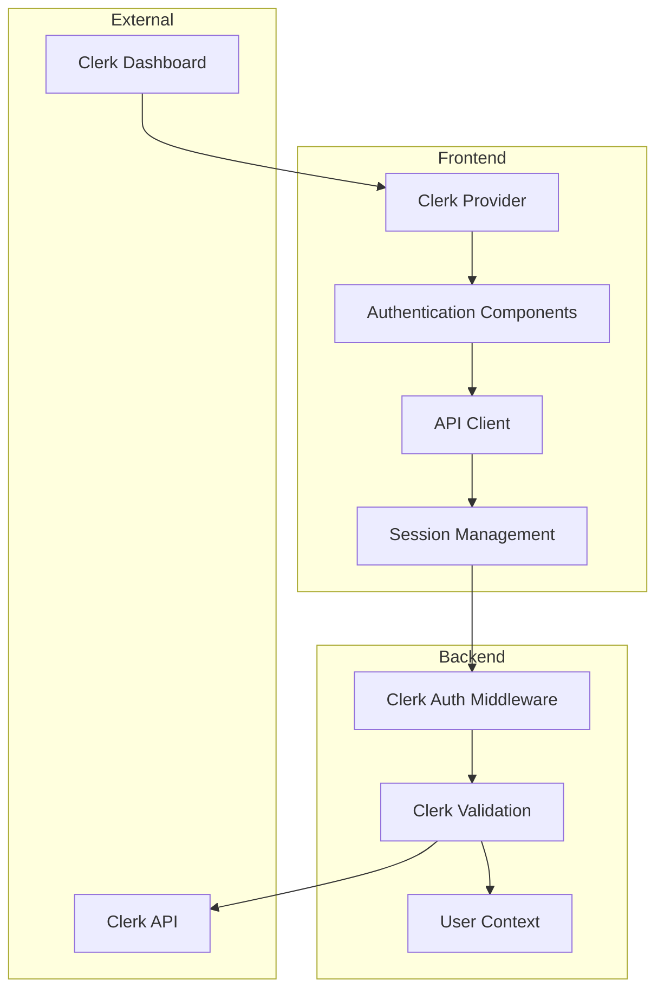

This document provides setup and configuration details for the pure Clerk authentication implementation in LeafLock.

## Architecture Overview

### System Design

LeafLock implements a **pure Clerk authentication system** that provides modern, secure authentication without any legacy JWT components:



### Authentication Flow

1. **Frontend Authentication**
   - User interacts with Clerk components (`SignIn`, `SignUp`)
   - Clerk handles authentication and creates session
   - Frontend gets session token via `useSession().getToken()`
   - API calls include `Authorization: Bearer <clerk-token>` header

2. **Backend Validation**
   - Clerk authentication middleware receives request
   - Validates Clerk session token
   - Sets user context for downstream handlers

3. **User Context**
   - Consistent interface regardless of auth method
   - `user_id`, `is_admin`, and other context available
   - Clerk user ID mapped to internal user ID

## Frontend Implementation

### Package Structure

```json
{
  "dependencies": {
    "@clerk/clerk-react": "^5.57.0",
    // ... other dependencies
  }
}
```

### Core Components

#### App.tsx - Clerk Provider Setup
```tsx title="src/App.tsx"
import { ClerkProvider } from '@clerk/clerk-react'

function App() {
  const [router, setRouter] = React.useState<any>(null)
  
  // Initialize Clerk API client with session
  useClerkApiClient()
  
  return (
    <ClerkProvider
      publishableKey={import.meta.env.VITE_CLERK_PUBLISHABLE_KEY}
      afterSignOutUrl="/login"
      signInUrl="/login"
      signUpUrl="/register"
    >
      <ThemeProvider>
        <EncryptionProvider>
          <RouterProvider router={router} />
        </EncryptionProvider>
      </ThemeProvider>
    </ClerkProvider>
  )
}
```

#### Router Configuration
```tsx title="src/router.tsx"
import { SignIn, SignUp, useAuth, useUser } from '@clerk/clerk-react'

// Login route with Clerk SignIn component
const loginRoute = createRoute({
  getParentRoute: () => rootRoute,
  path: 'login',
  component: () => (
    <ClerkAuthLayout>
      <SignIn
        routing="path"
        path="/login"
        signUpUrl="/register"
        afterSignInUrl="/"
        appearance={{
          elements: {
            rootBox: 'mx-auto',
            card: 'bg-background/95 backdrop-blur supports-[backdrop-filter]:bg-background/60',
            headerTitle: 'text-foreground',
            headerSubtitle: 'text-muted-foreground',
            socialButtonsBlockButton: 'bg-background border-border text-foreground hover:bg-accent',
            formFieldLabel: 'text-foreground',
            formFieldInput: 'bg-background border-border text-foreground',
            footerActionText: 'text-muted-foreground',
            footerActionLink: 'text-primary hover:text-primary/90',
          },
        }}
      />
    </ClerkAuthLayout>
  ),
})
```

#### Authentication Store
```tsx title="src/stores/clerkAuthStore.ts"
export const useClerkAuthStore = create<AuthState>((set) => ({
  user: null,
  isAuthenticated: false,
  isLoading: true,
  isAdmin: false,
  
  setUser: (user) => set({ user, isAuthenticated: !!user, isAdmin: user?.isAdmin || false }),
  setLoading: (loading) => set({ isLoading: loading }),
  logout: async () => {
    set({ user: null, isAuthenticated: false, isAdmin: false })
  },
}))

// Hook to sync Clerk auth state with store
export const useSyncClerkAuth = () => {
  const { isSignedIn, isLoaded } = useAuth()
  const { user: clerkUser } = useUser()
  
  const { setUser, setLoading } = useClerkAuthStore()
  
  React.useEffect(() => {
    if (!isLoaded) {
      setLoading(true)
      return
    }
    
    setLoading(false)
    
    if (isSignedIn && clerkUser) {
      const user: User = {
        id: clerkUser.id,
        email: clerkUser.primaryEmailAddress?.emailAddress || '',
        name: clerkUser.fullName || undefined,
        isAdmin: clerkUser.publicMetadata?.isAdmin === true || clerkUser.publicMetadata?.role === 'admin',
        createdAt: clerkUser.createdAt ? new Date(clerkUser.createdAt) : undefined,
        updatedAt: clerkUser.updatedAt ? new Date(clerkUser.updatedAt) : undefined,
      }
      setUser(user)
    } else {
      setUser(null)
    }
  }, [isSignedIn, isLoaded, clerkUser, setUser, setLoading])
}
```

### API Client Integration

#### Clerk API Client
```tsx title="src/services/api/clerkApiClient.ts"
export class ClerkApiClient {
  private baseURL: string
  private session: ReturnType<typeof useSession> | null = null

  async request<T>(endpoint: string, options: RequestInit = {}): Promise<T> {
    const url = `${this.baseURL}${endpoint}`
    
    // Get Clerk session token
    let token: string | null = null
    if (this.session && 'session' in this.session && this.session.session && 'getToken' in this.session.session) {
      try {
        token = await this.session.session.getToken()
      } catch (error) {
        console.warn('Failed to get Clerk session token:', error)
      }
    }
    
    const headers: Record<string, string> = {
      'Content-Type': 'application/json',
      ...(options.headers as Record<string, string> || {}),
    }

    if (token) {
      headers.Authorization = `Bearer ${token}`
    }

    const config: RequestInit = {
      ...options,
      headers,
      credentials: 'include',
    }

    const response = await fetch(url, config)

    if (!response.ok) {
      const errorData = await response.text()
      let errorMessage = `HTTP ${response.status}: ${response.statusText}`
      
      try {
        const parsedError = JSON.parse(errorData)
        errorMessage = parsedError.message || parsedError.error || errorMessage
      } catch {
        errorMessage = errorData || errorMessage
      }

      throw new Error(errorMessage)
    }

    const contentType = response.headers.get('content-type')
    if (contentType && contentType.includes('application/json')) {
      return await response.json()
    } else {
      return (await response.text()) as T
    }
  }
}
```

## Backend Implementation

### Configuration

#### Environment Variables
```go title="backend/config/config.go"
type Config struct {
    // ... existing fields
    
    // Clerk authentication configuration
    ClerkPublishableKey string
    ClerkSecretKey      string
}

func LoadConfig() *Config {
    return &Config{
        // ... existing configuration
        
        ClerkPublishableKey: GetEnvOrDefault("CLERK_PUBLISHABLE_KEY", ""),
        ClerkSecretKey:      GetEnvOrDefault("CLERK_SECRET_KEY", ""),
    }
}
```

#### Clerk SDK Integration
```go title="backend/auth/clerk_middleware.go"
import (
    "github.com/clerk/clerk-sdk-go/v2"
    "github.com/clerk/clerk-sdk-go/v2/jwt"
)

func InitializeClerk(secretKey string) error {
    if secretKey == "" {
        return fmt.Errorf("Clerk secret key is required")
    }
    clerk.SetKey(secretKey)
    return nil
}

func (h *Handler) validateClerkToken(ctx context.Context, token string) (*jwt.Claims, error) {
    claims, err := jwt.Verify(ctx, &jwt.VerifyParams{
        Token: token,
    })
    if err != nil {
        return nil, fmt.Errorf("failed to verify Clerk token: %w", err)
    }
    return claims, nil
}
```

### Clerk Authentication Middleware

```go title="backend/auth/clerk_middleware.go"
func (h *Handler) DualAuthMiddleware(c *fiber.Ctx) error {
    authHeader := c.Get("Authorization")
    if authHeader == "" {
        return c.Status(fiber.StatusUnauthorized).JSON(ErrorResponse{
            Error: "No authorization token provided",
            Code:  ErrCodeInvalidToken,
        })
    }

    parts := strings.Split(authHeader, " ")
    if len(parts) != 2 || parts[0] != "Bearer" {
        return c.Status(fiber.StatusUnauthorized).JSON(ErrorResponse{
            Error: "Invalid authorization format",
            Code:  ErrCodeInvalidToken,
        })
    }

    token := parts[1]

    // Try Clerk authentication first
    if h.config.ClerkSecretKey != "" {
        claims, err := h.validateClerkToken(c.Context(), token)
        if err == nil {
            userID, err := h.extractUserIDFromClerkClaims(claims)
            if err == nil {
                isAdmin := h.extractAdminStatusFromClerkClaims(claims)
                
                c.Locals("user_id", userID)
                c.Locals("is_admin", isAdmin)
                c.Locals("clerk_user_id", claims.Subject)
                c.Locals("auth_type", "clerk")
                c.Locals("token", token)
                
                return c.Next()
            }
        }
    }

    return c.Status(fiber.StatusUnauthorized).JSON(ErrorResponse{
        Error: "Invalid or expired Clerk session",
        Code:  ErrCodeInvalidToken,
    })
}
```

### Route Configuration

```go title="backend/routes.go"
func setupRoutes(app *fiber.App, db *pgxpool.Pool, rdb *redis.Client, config *appconfig.Config, startTime time.Time, readyState *appserver.ReadyState) {
    // ... existing middleware setup
    
    // Authentication routes (Clerk authentication)
    api.Post("/auth/logout", authHandler.ClerkAuthMiddleware, authHandler.Logout)
    
    // Protected routes (Clerk authentication)
    protected := api.Group("", authHandler.ClerkAuthMiddleware)
    
    // Admin routes (Clerk authentication)
    admin := protected.Group("/admin", authHandler.RequireAdminMiddleware)
    
    // ... rest of route setup
}
```

### User Creation and Mapping

```go title="backend/services/auth.go"
func (h *AuthHandler) getOrCreateUser(ctx context.Context, clerkUserID, email string, isAdmin bool) (uuid.UUID, error) {
    // Check if user mapping exists
    var userID uuid.UUID
    err := h.db.QueryRow(ctx, `
        SELECT user_id FROM user_clerk_mappings 
        WHERE clerk_user_id = $1
    `, clerkUserID).Scan(&userID)
    
    if err == nil {
        return userID, nil
    }
    
    if err != pgx.ErrNoRows {
        return uuid.Nil, fmt.Errorf("failed to check user mapping: %w", err)
    }
    
    // Create new user and mapping
    userID = uuid.New()
    
    tx, err := h.db.Begin(ctx)
    if err != nil {
        return uuid.Nil, fmt.Errorf("failed to begin transaction: %w", err)
    }
    defer tx.Rollback(ctx)
    
    // Create user
    _, err = tx.Exec(ctx, `
        INSERT INTO users (id, email, email_hash, is_admin, created_at, updated_at)
        VALUES ($1, $2, $3, $4, $5, $6)
    `, userID, email, hashEmail(email), isAdmin, time.Now(), time.Now())
    
    if err != nil {
        return uuid.Nil, fmt.Errorf("failed to create user: %w", err)
    }
    
    // Create mapping
    _, err = tx.Exec(ctx, `
        INSERT INTO user_clerk_mappings (user_id, clerk_user_id, created_at)
        VALUES ($1, $2, $3)
    `, userID, clerkUserID, time.Now())
    
    if err != nil {
        return uuid.Nil, fmt.Errorf("failed to create user mapping: %w", err)
    }
    
    if err := tx.Commit(ctx); err != nil {
        return uuid.Nil, fmt.Errorf("failed to commit transaction: %w", err)
    }
    
    return userID, nil
}
```

## Security Considerations

### Zero-Knowledge Architecture
LeafLock's zero-knowledge architecture is preserved:

- **Client-side encryption**: User content encrypted before reaching server
- **Password-derived keys**: Encryption keys derived from user passwords
- **No server-side keys**: Server never has access to encryption keys
- **Clerk separation**: Authentication handled separately from encryption

### Token Security

```go
// Secure token validation
type TokenValidationResult struct {
    UserID    uuid.UUID
    IsAdmin   bool
    AuthType  string
    ExpiresAt time.Time
}

func (h *Handler) validateTokenSecurely(ctx context.Context, token string) (*TokenValidationResult, error) {
    // Rate limiting check
    if err := h.checkRateLimit(ctx, token); err != nil {
        return nil, err
    }
    
    // Token format validation
    if len(token) < 32 {
        return nil, fmt.Errorf("invalid token format")
    }
    
    // Authentication method detection
    if strings.HasPrefix(token, "clerk_") {
        return h.validateClerkTokenSecure(ctx, token)
    }
    
    return h.validateJWTTokenSecure(ctx, token)
}
```

### Session Management

```go
// Secure session handling
func (h *Handler) createSecureSession(ctx context.Context, userID uuid.UUID, authType string) (*Session, error) {
    session := &Session{
        ID:        uuid.New(),
        UserID:    userID,
        AuthType:  authType,
        IPAddress: getClientIP(ctx),
        UserAgent: getUserAgent(ctx),
        ExpiresAt: time.Now().Add(h.config.SessionDuration),
        CreatedAt: time.Now(),
    }
    
    // Encrypt sensitive session data
    encryptedSession, err := h.encryptSessionData(session)
    if err != nil {
        return nil, fmt.Errorf("failed to encrypt session: %w", err)
    }
    
    // Store in Redis with TTL
    err = h.redis.Set(ctx, fmt.Sprintf("session:%s", session.ID), encryptedSession, h.config.SessionDuration).Err()
    if err != nil {
        return nil, fmt.Errorf("failed to store session: %w", err)
    }
    
    return session, nil
}
```

## Performance Optimization

### Token Caching
```go
// Cache validated tokens to reduce API calls
type TokenCache struct {
    cache map[string]*CachedToken
    mutex sync.RWMutex
}

type CachedToken struct {
    UserID    uuid.UUID
    IsAdmin   bool
    AuthType  string
    ExpiresAt time.Time
}

func (tc *TokenCache) Get(token string) (*CachedToken, bool) {
    tc.mutex.RLock()
    defer tc.mutex.RUnlock()
    
    cached, exists := tc.cache[token]
    if !exists {
        return nil, false
    }
    
    if time.Now().After(cached.ExpiresAt) {
        return nil, false
    }
    
    return cached, true
}
```

### Database Query Optimization
```go
// Optimized user lookup with Clerk integration
func (h *Handler) getUserWithClerk(ctx context.Context, userID uuid.UUID) (*User, error) {
    var user User
    var clerkUserID sql.NullString
    
    err := h.db.QueryRow(ctx, `
        SELECT u.id, u.email, u.is_admin, u.created_at, 
               ucm.clerk_user_id, u.public_metadata
        FROM users u
        LEFT JOIN user_clerk_mappings ucm ON u.id = ucm.user_id
        WHERE u.id = $1
    `, userID).Scan(
        &user.ID, &user.Email, &user.IsAdmin, &user.CreatedAt,
        &clerkUserID, &user.PublicMetadata,
    )
    
    if err != nil {
        return nil, fmt.Errorf("failed to get user: %w", err)
    }
    
    if clerkUserID.Valid {
        user.ClerkUserID = clerkUserID.String
    }
    
    return &user, nil
}
```

## Testing Strategy

### Unit Tests
```go
func TestClerkTokenValidation(t *testing.T) {
    tests := []struct {
        name        string
        token       string
        expectError bool
    }{
        {
            name:        "valid clerk token",
            token:       "clerk_test_valid_token",
            expectError: false,
        },
        {
            name:        "invalid clerk token",
            token:       "invalid_token",
            expectError: true,
        },
        {
            name:        "expired clerk token",
            token:       "clerk_test_expired_token",
            expectError: true,
        },
    }
    
    for _, tt := range tests {
        t.Run(tt.name, func(t *testing.T) {
            ctx := context.Background()
            claims, err := testHandler.validateClerkToken(ctx, tt.token)
            
            if tt.expectError {
                assert.Error(t, err)
            } else {
                assert.NoError(t, err)
                assert.NotNil(t, claims)
            }
        })
    }
}
```

### Integration Tests
```go
func TestClerkAuthentication(t *testing.T) {
    // Test with Clerk token
    t.Run("clerk authentication", func(t *testing.T) {
        req := httptest.NewRequest("GET", "/api/protected", nil)
        req.Header.Set("Authorization", "Bearer clerk_test_token")
        
        rec := httptest.NewRecorder()
        testApp.ServeHTTP(rec, req)
        
        assert.Equal(t, http.StatusOK, rec.Code)
    })
    
    // Test with invalid token
    t.Run("invalid authentication", func(t *testing.T) {
        req := httptest.NewRequest("GET", "/api/protected", nil)
        req.Header.Set("Authorization", "Bearer invalid_token")
        
        rec := httptest.NewRecorder()
        testApp.ServeHTTP(rec, req)
        
        assert.Equal(t, http.StatusUnauthorized, rec.Code)
    })
}
```

## Monitoring and Observability

### Authentication Metrics
```go
// Authentication metrics
type AuthMetrics struct {
    ClerkValidations   prometheus.Counter
    ValidationErrors   prometheus.Counter
}

func (h *Handler) recordAuthMetrics(authType string, success bool) {
    labels := prometheus.Labels{
        "auth_type": authType,
        "success":   strconv.FormatBool(success),
    }
    
    if success {
        h.metrics.ClerkValidations.With(labels).Inc()
    } else {
        h.metrics.ValidationErrors.With(labels).Inc()
    }
}
```

### Logging Strategy
```go
// Structured logging for authentication events
func (h *Handler) logAuthEvent(ctx context.Context, event string, userID uuid.UUID, authType string, success bool) {
    logger := h.logger.WithFields(logrus.Fields{
        "event":     event,
        "user_id":   userID,
        "auth_type": authType,
        "success":   success,
        "ip":        getClientIP(ctx),
        "user_agent": getUserAgent(ctx),
    })
    
    if success {
        logger.Info("authentication event")
    } else {
        logger.Warn("authentication failure")
    }
}
```

This implementation provides a robust, secure, and scalable authentication system that maintains backward compatibility while enabling modern authentication features through Clerk.