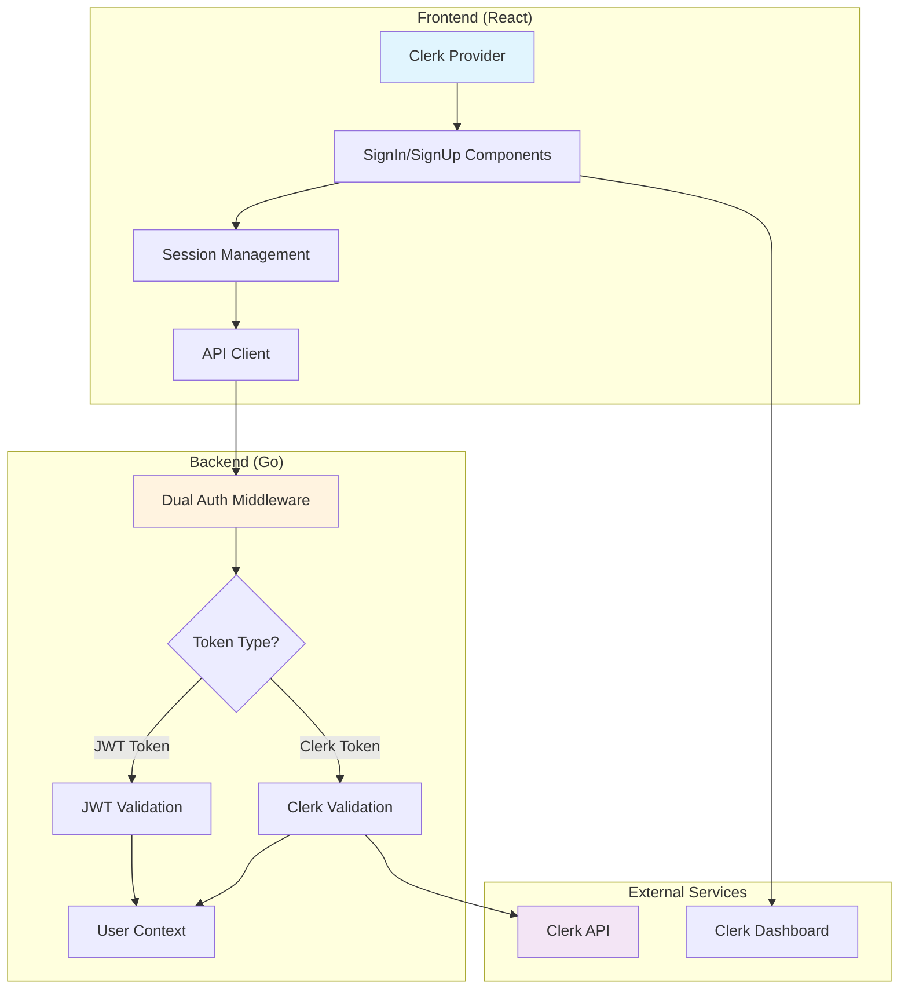

import { CardGrid, Card, LinkCard } from '@astrojs/starlight/components';

LeafLock uses [Clerk](https://clerk.com) for modern, secure authentication. This integration provides enterprise-grade authentication features while maintaining LeafLock's zero-knowledge architecture and end-to-end encryption.

## 🚀 What's New

LeafLock has transitioned from a custom JWT-based authentication system to **Clerk**, providing:

- **Modern Authentication**: Social logins, passwordless auth, passkeys, MFA
- **Enterprise Security**: Automatic breach detection, bot protection, rate limiting  
- **Professional UX**: Beautiful, accessible authentication components
- **Developer Experience**: Type-safe, well-documented, easy to integrate
- **Compliance**: Built-in GDPR, SOC 2, HIPAA compliance

## 🎯 Quick Start

Get Clerk authentication running in under 5 minutes:

<LinkCard
  title="Quick Start Guide"
  description="Set up Clerk authentication in 5 minutes"
  href="./quick-start"
  icon="rocket"
/>

## 📚 Documentation

<CardGrid>
  <Card title="Integration Guide" icon="plug">
    Learn how Clerk is integrated into LeafLock's architecture
    
    [Read Guide →](./clerk-integration)
  </Card>
  
  <Card title="Implementation Details" icon="code">
    Technical details, code examples, and architecture decisions
    
    [View Details →](./implementation)
  </Card>
  
  <Card title="Configuration Reference" icon="gear">
    Complete reference for all authentication configuration options
    
    [View Reference →](./configuration)
  </Card>
  
  <Card title="Migration Guide" icon="arrow-right">
    Step-by-step guide for migrating from JWT to Clerk
    
    [Start Migration →](./migration)
  </Card>
  
  <Card title="Troubleshooting" icon="wrench">
    Common issues and solutions for authentication problems
    
    [Get Help →](./troubleshooting)
  </Card>
</CardGrid>

## 🔧 Architecture Overview

LeafLock implements a **dual authentication system** that supports both legacy JWT tokens and modern Clerk authentication during the migration period:



### Key Features

- **Zero-Downtime Migration**: Existing users continue working during transition
- **Zero-Knowledge Architecture**: End-to-end encryption preserved
- **Type Safety**: Full TypeScript support throughout the stack
- **Professional Security**: Enterprise-grade authentication security
- **Modern UX**: Accessible, beautiful authentication components

## 🎨 Authentication Components

LeafLock includes professionally designed authentication components that match your theme:

### Sign-In Component
- Email/password authentication
- Social login buttons (Google, GitHub, etc.)
- Password reset links
- Fully customizable appearance

### Sign-Up Component  
- User registration with validation
- Password strength indicators
- Terms acceptance
- Email verification

### User Profile
- Account management
- Password changes
- MFA setup
- Social connections

## ⚙️ Configuration

### Required Settings

```bash
# Clerk Authentication (Required)
CLERK_PUBLISHABLE_KEY=pk_test_your_key_here
CLERK_SECRET_KEY=sk_test_your_key_here
VITE_CLERK_PUBLISHABLE_KEY=pk_test_your_key_here

# Registration Control
VITE_ENABLE_REGISTRATION=true
```

### Optional Settings

```bash
# Custom URLs
CLERK_SIGN_IN_URL=/login
CLERK_SIGN_UP_URL=/register
CLERK_AFTER_SIGN_IN_URL=/

# Security Settings
MAX_LOGIN_ATTEMPTS=5
LOCKOUT_MINUTES=15
```

## 🛡️ Security Features

### Built-in Security
- **Automatic Breach Detection**: Passwords checked against known breaches
- **Bot Protection**: Advanced bot detection and prevention
- **Rate Limiting**: Built-in protection against brute force attacks
- **Session Management**: Secure session handling with automatic refresh

### Compliance
- **GDPR Compliant**: Built-in privacy controls and data export
- **SOC 2 Type 2**: Regular security audits and compliance
- **HIPAA Ready**: Available with BAA for healthcare applications

### Zero-Knowledge Architecture
- **Client-side Encryption**: User content encrypted before reaching server
- **Password-derived Keys**: Encryption keys derived from user passwords
- **No Server-side Keys**: Server never has access to encryption keys

## 📊 Migration Status

### Current Status
- ✅ **Dual Authentication**: Both JWT and Clerk work simultaneously
- ✅ **Backend Integration**: Clerk middleware implemented
- ✅ **Frontend Components**: Clerk components integrated
- ✅ **Type Safety**: Full TypeScript support
- ✅ **Testing**: Integration tests passing

### Next Steps
1. **Get Clerk Keys**: Sign up at [Clerk Dashboard](https://dashboard.clerk.com)
2. **Configure Environment**: Add your Clerk keys to `.env`
3. **Test Authentication**: Try the sign-in/sign-up flow
4. **Migrate Users**: Gradually move users to Clerk (optional)

## 🚀 Getting Started

### For New Projects
Start with Clerk authentication from day one:

```bash
# 1. Get Clerk keys
# Go to https://dashboard.clerk.com

# 2. Configure environment
echo "CLERK_PUBLISHABLE_KEY=pk_test_your_key" >> .env
echo "CLERK_SECRET_KEY=sk_test_your_key" >> .env
echo "VITE_CLERK_PUBLISHABLE_KEY=pk_test_your_key" >> .env

# 3. Start development
./scripts/setup-clerk-dev.sh
```

### For Existing Projects
Migrate from JWT to Clerk gradually:

```bash
# 1. Add Clerk configuration (keep JWT for now)
echo "CLERK_PUBLISHABLE_KEY=pk_test_your_key" >> .env
echo "CLERK_SECRET_KEY=sk_test_your_key" >> .env

# 2. Deploy with dual authentication
make deploy

# 3. Test both authentication methods work
# 4. Gradually migrate users
# 5. Remove JWT when ready
```

## 📈 Benefits

### For Users
- **Better Security**: Professional-grade authentication security
- **Modern Experience**: Beautiful, accessible authentication flows
- **More Options**: Social logins, passwordless auth, MFA
- **Reliability**: Enterprise-grade uptime and performance

### For Developers
- **Reduced Maintenance**: No more custom auth code to maintain
- **Better Documentation**: Comprehensive guides and examples
- **Type Safety**: Full TypeScript support throughout
- **Professional Support**: Access to Clerk's support team

### For Business
- **Compliance**: Built-in GDPR, SOC 2, HIPAA compliance
- **Scalability**: Handles authentication at enterprise scale
- **Cost Effective**: Free tier covers most use cases
- **Risk Reduction**: Professional security team oversight

## 🔗 Related Documentation

- **[Quick Start](./quick-start)** - Get running in 5 minutes
- **[Implementation Details](./implementation)** - Technical architecture
- **[Configuration Reference](./configuration)** - All configuration options
- **[Migration Guide](./migration)** - Move from JWT to Clerk
- **[Troubleshooting](./troubleshooting)** - Fix common issues

---

**Ready to upgrade your authentication?** Start with the [Quick Start Guide](./quick-start) and experience modern, secure authentication with Clerk and LeafLock! 🚀