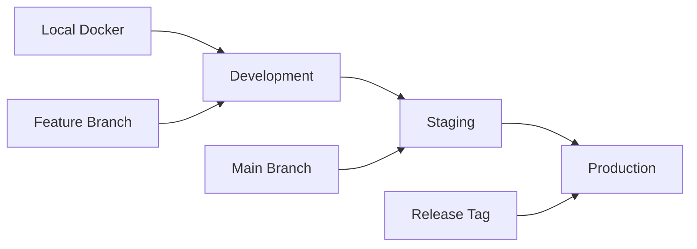

import { Tabs, TabItem } from '@astrojs/starlight/components';
import { Card, CardGrid } from '@astrojs/starlight/components';
import { Badge } from '@astrojs/starlight/components';

Choose the best deployment platform for your LeafLock instance based on your requirements, expertise, and infrastructure needs.

## Platform Comparison

<CardGrid>
  <Card title="🚅 Railway" icon="rocket">
    **Best For:** Modern applications, startups, rapid deployment

    **Key Features:**
    - IPv6-first private networking
    - Git-based deployments
    - Automatic HTTPS
    - Zero-configuration networking
    - Built-in monitoring

    **Ideal If:**
    - You want the simplest deployment
    - You need automatic scaling
    - You prefer modern cloud infrastructure
    - You're building a new project

    <Badge text="IPv6 Native" variant="success" />
    <Badge text="Zero Config" variant="note" />
  </Card>

  <Card title="❄️ Coolify" icon="setting">
    **Best For:** Self-hosted, cost-conscious, Docker expertise

    **Key Features:**
    - Self-hosted platform
    - Docker-based deployments
    - Domain and SSL management
    - Environment variable management
    - Resource monitoring

    **Ideal If:**
    - You want to self-host
    - You have existing servers
    - You need cost control
    - You prefer Docker Compose

    <Badge text="Self-Hosted" variant="caution" />
    <Badge text="Docker Native" variant="note" />
  </Card>

  <Card title="🐳 Docker" icon="docker">
    **Best For:** Development, custom infrastructure, full control

    **Key Features:**
    - Container orchestration
    - Portable deployment
    - Custom networking
    - Volume management
    - Multi-stage builds

    **Ideal If:**
    - You have Docker expertise
    - You need custom configurations
    - You're developing locally
    - You want full control

    <Badge text="Full Control" variant="tip" />
    <Badge text="Portable" variant="note" />
  </Card>

  <Card title="☸️ Kubernetes" icon="approve-check">
    **Best For:** Enterprise, high availability, complex scaling

    **Key Features:**
    - Enterprise-grade orchestration
    - Auto-scaling and healing
    - Advanced networking
    - Monitoring and observability
    - Multi-environment support

    **Ideal If:**
    - You need enterprise features
    - You have K8s expertise
    - You require high availability
    - You need complex scaling

    <Badge text="Enterprise Grade" variant="success" />
    <Badge text="High Availability" variant="tip" />
  </Card>
</CardGrid>

## Quick Decision Matrix

| Requirement | Railway | Coolify | Docker | Kubernetes |
|-------------|---------|---------|--------|------------|
| **Ease of Setup** | ⭐⭐⭐⭐⭐ | ⭐⭐⭐⭐ | ⭐⭐⭐ | ⭐⭐ |
| **Production Ready** | ⭐⭐⭐⭐⭐ | ⭐⭐⭐⭐ | ⭐⭐⭐ | ⭐⭐⭐⭐⭐ |
| **Scaling** | ⭐⭐⭐⭐ | ⭐⭐⭐ | ⭐⭐ | ⭐⭐⭐⭐⭐ |
| **Cost (Small)** | ⭐⭐⭐ | ⭐⭐⭐⭐⭐ | ⭐⭐⭐⭐⭐ | ⭐⭐ |
| **Cost (Large)** | ⭐⭐⭐ | ⭐⭐⭐⭐ | ⭐⭐⭐⭐ | ⭐⭐⭐⭐ |
| **Maintenance** | ⭐⭐⭐⭐⭐ | ⭐⭐⭐ | ⭐⭐ | ⭐⭐ |
| **Customization** | ⭐⭐⭐ | ⭐⭐⭐⭐ | ⭐⭐⭐⭐⭐ | ⭐⭐⭐⭐⭐ |

## Deployment Guides

### 🚀 Quick Start (Recommended)

<Card title="Railway - Fastest Deployment" icon="rocket">
**Perfect for getting started quickly:**

1. **[Railway Deployment Guide](/deployment/railway/)** - Complete Railway setup with IPv6 support
2. **[Deployment Readiness Report](/deployment/deployment-readiness/)** - Verify your deployment

**Time to Deploy:** ~15 minutes
**Difficulty:** Beginner
**Maintenance:** Minimal
</Card>

### 🏗️ Self-Hosted Solutions

<CardGrid>
  <Card title="❄️ Coolify Platform" icon="setting">
    **Self-hosted deployment platform:**

    - [Coolify Deployment Guide](/deployment/coolify/)
    - [Quick Coolify Setup](/deployment/coolify-setup/)

    **Time to Deploy:** ~30 minutes
    **Difficulty:** Intermediate
    **Best For:** Self-hosting enthusiasts
  </Card>

  <Card title="🐳 Docker Compose" icon="docker">
    **Direct container deployment:**

    - [Docker Deployment Guide](/deployment/docker/)

    **Time to Deploy:** ~45 minutes
    **Difficulty:** Intermediate
    **Best For:** Development & custom setups
  </Card>
</CardGrid>

### 🏢 Enterprise Solutions

<Card title="☸️ Kubernetes Orchestration" icon="approve-check">
**Enterprise-grade deployment:**

- [Kubernetes Deployment Guide](/deployment/kubernetes/)

**Time to Deploy:** ~2-4 hours
**Difficulty:** Advanced
**Best For:** Enterprise environments, high availability requirements
</Card>

## Architecture Overview

### LeafLock Components

<Card title="🏗️ Application Architecture" icon="setting">
**Multi-Service Architecture:**
- **Frontend:** React 18 + TypeScript with Vite
- **Backend:** Go 1.21+ with Fiber framework
- **Database:** PostgreSQL 15 with encrypted storage
- **Cache:** Redis 7 for session management
- **Proxy:** Nginx for load balancing and SSL termination

**Security Features:**
- End-to-end encryption with XChaCha20-Poly1305
- Zero-knowledge architecture
- Argon2id password hashing
- JWT authentication with refresh tokens
</Card>

### Network Requirements

<CardGrid>
  <Card title="🌐 IPv6 Support" icon="setting">
    **Modern Networking:**
    - IPv6 dual-stack support
    - Universal service discovery
    - Railway private network compatible
    - Kubernetes network policies ready
  </Card>
  <Card title="🔒 Security Requirements" icon="lock">
    **Security Standards:**
    - HTTPS/TLS 1.3 required
    - Strong CORS policies
    - Security headers configured
    - Rate limiting implemented
  </Card>
</CardGrid>

## Environment Configuration

### Required Secrets

All deployment platforms require these essential environment variables:

<Tabs>
  <TabItem label="Security Keys">
    ```bash
    # JWT Authentication (64+ characters)
    JWT_SECRET=your_base64_encoded_jwt_secret_64_chars_minimum

    # Server Encryption (32 characters exactly)
    SERVER_ENCRYPTION_KEY=your_32_character_encryption_key

    # Database Password (32+ characters)
    POSTGRES_PASSWORD=your_secure_postgres_password

    # Redis Password (16+ characters)
    REDIS_PASSWORD=your_secure_redis_password
    ```
  </TabItem>
  <TabItem label="Application Config">
    ```bash
    # CORS Origins (platform-specific)
    CORS_ORIGINS=https://yourdomain.com

    # Frontend API URL
    VITE_API_URL=https://yourdomain.com/api/v1

    # Application Environment
    APP_ENV=production
    ENABLE_REGISTRATION=false  # Secure default - set to true to enable public registration
    ```
  </TabItem>
  <TabItem label="Admin User">
    ```bash
    # Default Admin Account
    ENABLE_DEFAULT_ADMIN=true
    DEFAULT_ADMIN_EMAIL=admin@yourdomain.com
    DEFAULT_ADMIN_PASSWORD=YourSecureAdminPassword123!
    ```
  </TabItem>
</Tabs>

### Generate Secure Values

```bash
# Generate all required secrets at once
echo "# LeafLock Environment Secrets"
echo "JWT_SECRET=$(openssl rand -base64 64 | tr -d '\n')"
echo "SERVER_ENCRYPTION_KEY=$(openssl rand -base64 32 | tr -d '\n')"
echo "POSTGRES_PASSWORD=$(openssl rand -base64 32 | tr -d '\n')"
echo "REDIS_PASSWORD=$(openssl rand -base64 32 | tr -d '\n')"
echo "DEFAULT_ADMIN_PASSWORD=$(openssl rand -base64 24 | tr -d '\n')LeafLock!"
```

## Deployment Workflows

### CI/CD Integration

<Card title="🔄 Automated Deployments" icon="github">
**GitHub Actions Integration:**
- Automated testing on pull requests
- Container image building and pushing
- Deployment to staging/production
- Security scanning and compliance checks

**Supported Platforms:**
- ✅ Railway (git-based deployment)
- ✅ Coolify (webhook deployment)
- ✅ Kubernetes (ArgoCD/GitOps)
- ✅ Docker (registry-based deployment)
</Card>

### Environment Promotion



## Monitoring and Observability

### Health Checks

All deployment platforms include comprehensive health monitoring:

<CardGrid>
  <Card title="🔍 Application Health" icon="list-format">
    **Built-in Endpoints:**
    - `/api/v1/health` - Comprehensive system status
    - `/api/v1/ready` - Kubernetes readiness probe
    - `/metrics` - Prometheus metrics (optional)

    **Response Example:**
    ```json
    {
      "status": "healthy",
      "database": "connected",
      "redis": "connected",
      "version": "1.0.0",
      "uptime": "2h 15m 30s"
    }
    ```
  </Card>
  <Card title="📊 Platform Monitoring" icon="approve-check">
    **Platform-Specific:**
    - **Railway:** Built-in metrics and logs
    - **Coolify:** Resource monitoring dashboard
    - **Docker:** Container stats and logs
    - **Kubernetes:** Prometheus + Grafana stack
  </Card>
</CardGrid>

### Performance Metrics

Expected performance benchmarks across all platforms:

| Metric | Target | Excellent |
|--------|---------|-----------|
| **API Response Time** | &lt;100ms | &lt;50ms |
| **Page Load Time** | &lt;2s | &lt;1s |
| **Database Queries** | &lt;50ms | &lt;10ms |
| **Memory Usage** | &lt;512MB | &lt;256MB |
| **CPU Usage** | &lt;80% | &lt;50% |

## Security Considerations

### Production Security Checklist

<Card title="🔒 Security Hardening" icon="lock">
**Essential Security Measures:**
- [ ] **Strong Secrets:** All environment variables use cryptographically secure values
- [ ] **HTTPS Only:** Force HTTPS with proper SSL/TLS configuration
- [ ] **CORS Policy:** Restrict origins to your actual domains
- [ ] **Rate Limiting:** Protect against brute force and DDoS
- [ ] **Security Headers:** Implement OWASP security headers
- [ ] **Regular Updates:** Keep dependencies and base images updated
- [ ] **Backup Strategy:** Automated backups with encryption
- [ ] **Access Control:** Limit admin access and use MFA
</Card>

### Platform-Specific Security

<CardGrid>
  <Card title="🚅 Railway Security" icon="rocket">
    - Automatic HTTPS certificates
    - Private network isolation
    - Environment variable encryption
    - Regular security updates
  </Card>
  <Card title="❄️ Coolify Security" icon="setting">
    - Docker container isolation
    - Host-level security hardening
    - SSL certificate management
    - Access control and authentication
  </Card>
  <Card title="🐳 Docker Security" icon="docker">
    - Non-root container execution
    - Network segmentation
    - Volume access restrictions
    - Image vulnerability scanning
  </Card>
  <Card title="☸️ Kubernetes Security" icon="approve-check">
    - Pod security policies
    - Network policies
    - RBAC authentication
    - Secret management
    - Security scanning and compliance
  </Card>
</CardGrid>

## Migration Between Platforms

### Data Migration

<Card title="🔄 Platform Migration Guide" icon="setting">
**Database Migration:**
1. Export data from source platform
2. Create backup archive
3. Set up target platform
4. Import data to target
5. Update DNS and environment variables
6. Verify functionality

**Common Migration Paths:**
- Docker → Railway (easiest)
- Coolify → Kubernetes (enterprise upgrade)
- Railway → Self-hosted (cost optimization)
</Card>

### Migration Scripts

```bash
# Export database backup
pg_dump $SOURCE_DATABASE_URL > leaflock_backup.sql

# Environment variable migration
# Export from source platform
env | grep -E "(JWT_SECRET|SERVER_ENCRYPTION_KEY|POSTGRES_PASSWORD)" > migration.env

# Import to target platform
# (platform-specific import process)
```

## Troubleshooting

### Common Issues

<CardGrid>
  <Card title="🔌 Connectivity Issues" icon="warning">
    **Symptoms:**
    - Frontend shows "No available server"
    - API requests timeout
    - Database connection errors

    **Solutions:**
    1. Check environment variables
    2. Verify network connectivity
    3. Review service discovery configuration
    4. Check health endpoints
  </Card>
  <Card title="🔐 Authentication Problems" icon="error">
    **Symptoms:**
    - Login failures with correct credentials
    - JWT token errors
    - Admin access denied

    **Solutions:**
    1. Verify JWT_SECRET is set correctly
    2. Check password complexity requirements
    3. Review CORS origins configuration
    4. Reset admin user if needed
  </Card>
</CardGrid>

### Debug Commands

<Tabs>
  <TabItem label="Railway">
    ```bash
    # Check logs
    railway logs

    # Test health endpoints
    curl https://your-app.up.railway.app/api/v1/health

    # Environment variables
    railway variables
    ```
  </TabItem>
  <TabItem label="Docker">
    ```bash
    # Check container status
    docker compose ps

    # View logs
    docker compose logs -f backend

    # Test health
    curl http://localhost:8080/api/v1/health
    ```
  </TabItem>
  <TabItem label="Kubernetes">
    ```bash
    # Check pods
    kubectl get pods -n leaflock

    # View logs
    kubectl logs -f deployment/backend -n leaflock

    # Test services
    kubectl port-forward svc/frontend 3000:80 -n leaflock
    ```
  </TabItem>
</Tabs>

## Support and Resources

### Getting Help

<Card title="📞 Support Channels" icon="github">
**Community Support:**
- GitHub Issues for bug reports
- Discussions for questions and ideas
- Documentation for comprehensive guides

**Professional Support:**
- Enterprise consulting available
- Custom deployment assistance
- Security audits and compliance
</Card>

### Additional Resources

- **[Administration Guide](/administration/user-management/)** - User and admin management
- **[Development Guide](/development/development-guide/)** - Contributing and development
- **[Security Documentation](/deployment/deployment-readiness/)** - Security features and compliance

---

<Badge text="Production Ready" variant="success" size="large" />
<Badge text="Multi-Platform" variant="note" size="large" />
<Badge text="Enterprise Grade" variant="tip" size="large" />

*Choose your deployment platform and get LeafLock running in production with confidence.*