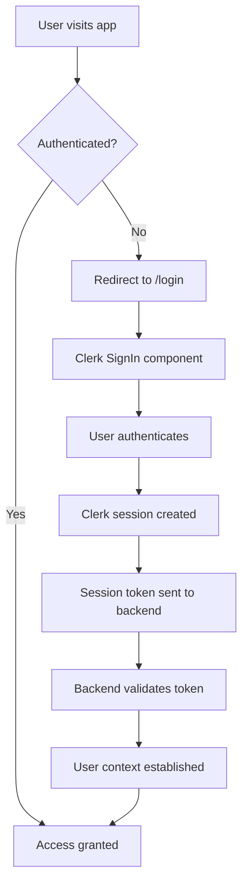
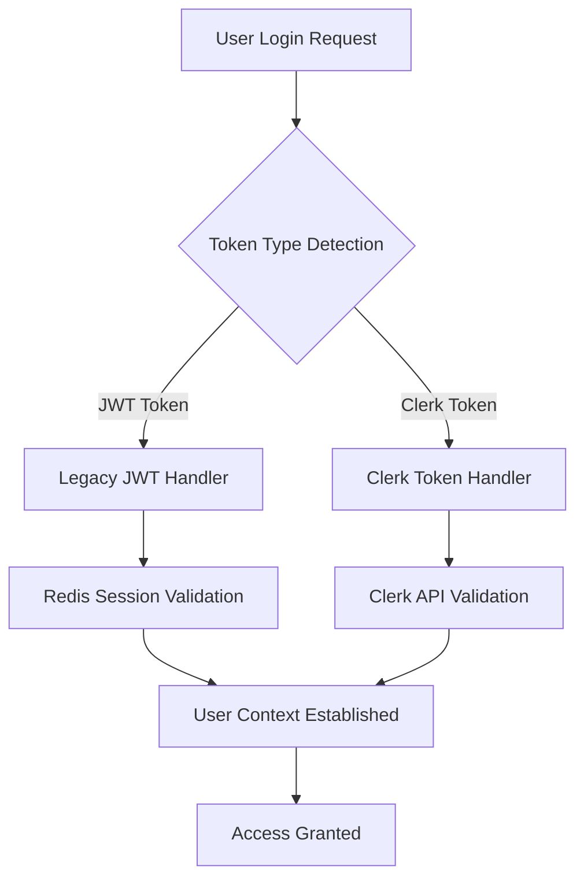

import { Code, Tabs, TabItem } from '@astrojs/starlight/components';

## Modern Authentication with Clerk

LeafLock uses [Clerk](https://clerk.com) for enterprise-grade authentication, providing modern security features while maintaining LeafLock's zero-knowledge architecture.

**Key Benefits**:
- **Enterprise Security**: SOC 2, GDPR, HIPAA compliant with built-in threat detection
- **Multiple Auth Methods**: Email/password, social logins, magic links, passkeys, SAML SSO
- **Advanced MFA**: TOTP, SMS, email codes, backup codes with risk-based authentication
- **Organization Management**: Multi-tenant support with role-based access control
- **Developer Experience**: Pre-built components, comprehensive APIs, excellent documentation

## Authentication Architecture

### Authentication Flow



### Dual Authentication Support

During migration, LeafLock supports both authentication methods:

- **Clerk Authentication**: New users and gradual migration (recommended)
- **Legacy JWT**: Existing users continue working during transition
- **Automatic Detection**: Backend intelligently handles both token types

## Authentication Methods

### Primary Authentication
<Tabs>
  <TabItem label="Email & Password">
- **Secure password policies**: Minimum requirements with strength validation
- **Breach detection**: Automatic checking against known password breaches
- **Account protection**: Rate limiting and lockout protection
- **Password reset**: Secure email-based reset with time-limited tokens
  </TabItem>
  
  <TabItem label="Social Login">
- **Google OAuth**: Enterprise Google Workspace integration
- **GitHub OAuth**: Developer-friendly GitHub authentication
- **Microsoft/Azure**: Azure AD and Microsoft account support
- **Facebook/Twitter**: Additional social providers available
- **Custom SAML**: Enterprise SAML SSO configuration
  </TabItem>
  
  <TabItem label="Passwordless">
- **Magic Links**: Email-based passwordless authentication
- **One-time Codes**: SMS and email verification codes
- **Passkeys**: Modern FIDO2/WebAuthn passwordless authentication
- **Social Sign-in**: One-click social authentication
  </TabItem>
</Tabs>

## Multi-Factor Authentication (MFA)

Clerk provides comprehensive MFA with multiple authentication methods and intelligent security features.

### MFA Methods
<Tabs>
  <TabItem label="Authenticator Apps">
- **TOTP (Time-based One-Time Password)**: Standard RFC 6238 implementation
- **Supported Apps**: Google Authenticator, Authy, 1Password, Microsoft Authenticator
- **Setup**: QR code scanning or manual secret entry
- **Security**: 30-second code window with time synchronization
  </TabItem>
  
  <TabItem label="SMS/Text Messages">
- **Phone verification**: Codes sent to registered phone numbers
- **Global coverage**: International SMS support
- **Backup codes**: Alternative when SMS unavailable
- **Rate limiting**: Protection against SMS abuse
  </TabItem>
  
  <TabItem label="Email Codes">
- **Email verification**: Codes sent to registered email addresses
- **Backup method**: Alternative to primary MFA method
- **Secure delivery**: Encrypted email transmission
- **Time-limited**: Short expiration for security
  </TabItem>
  
  <TabItem label="Backup Codes">
- **Emergency access**: 8-digit one-time use codes
- **Automatic generation**: Created when MFA is enabled
- **Secure storage**: Encrypted and never displayed twice
- **Cross-platform**: Work across all Clerk-enabled applications
  </TabItem>
</Tabs>

### Advanced MFA Features

#### Risk-Based Authentication
Intelligent MFA that adapts based on security context:
- **Location-based**: Different requirements for new locations
- **Device-based**: Enhanced security for unrecognized devices
- **Behavior-based**: Detection of unusual login patterns
- **Time-based**: Variable requirements based on access timing

#### Organization MFA Policies
For enterprise deployments:
- **Required MFA**: Enforce MFA for all organization members
- **Role-based**: Different MFA requirements by role (admin, member, etc.)
- **Conditional**: MFA based on resource sensitivity
- **Grace periods**: Allow time for users to set up MFA

## Enterprise Features

### Organization Management
Multi-tenant support for B2B applications:

```tsx
// Organization switching
import { OrganizationSwitcher } from '@clerk/clerk-react'

// Organization profile management
import { OrganizationProfile } from '@clerk/clerk-react'
```

**Features**:
- **Organization creation**: Users can create and manage organizations
- **Role-based access**: Admin, member, and custom roles
- **Domain-based enrollment**: Automatic organization membership
- **Multi-organization**: Users can belong to multiple organizations

### Enterprise SSO
SAML and enterprise identity provider support:

- **SAML 2.0**: Full SAML SSO implementation
- **SCIM provisioning**: Automated user lifecycle management
- **Directory integration**: Active Directory and LDAP support
- **Custom identity providers**: Support for enterprise IdPs

### Advanced Security

#### Threat Detection
- **Breach detection**: Automatic detection of compromised credentials
- **Bot protection**: Advanced bot detection and prevention
- **Anomaly detection**: Unusual login pattern identification
- **Rate limiting**: Intelligent protection across all endpoints

#### Audit and Compliance
- **Comprehensive audit logs**: All authentication events tracked
- **Compliance reporting**: Built-in compliance reporting
- **Data retention policies**: Configurable data retention
- **Privacy controls**: GDPR, CCPA, and other privacy regulations

## Session Management

### Advanced Session Features
- **Multi-device sessions**: Users can manage sessions across devices
- **Session revocation**: "Log out of other devices" functionality
- **Detailed session info**: IP addresses, device information, last active times
- **Automatic session expiration**: Configurable session timeouts
- **Suspicious activity detection**: Automatic detection of unusual session behavior

### Session API Endpoints

```bash
# Get current session information
GET /api/v1/clerk/session/info
Headers: Authorization: Bearer <clerk_session_token>

# List all user sessions
GET /api/v1/clerk/sessions
Headers: Authorization: Bearer <clerk_session_token>

# Revoke specific session
POST /api/v1/clerk/sessions/{sessionId}/revoke
Headers: Authorization: Bearer <clerk_session_token>
```

## API Integration

### Authentication Endpoints

<Tabs>
  <TabItem label="Core Authentication">
```bash
# Modern Clerk authentication
POST /api/v1/auth/login
Body: { "email": "user@example.com", "password": "..." }
Response: { "message": "Authentication successful", "auth_type": "clerk" }

# Logout (revokes Clerk session)
POST /api/v1/auth/logout
Headers: Authorization: Bearer <clerk_session_token>

# Registration status
GET /api/v1/auth/registration
Response: { "enabled": true }
```
  </TabItem>
  
  <TabItem label="Clerk-Specific Endpoints">
```bash
# Get session information
GET /api/v1/clerk/session/info
Response: {
  "session": { "session_id": "...", "status": "active" },
  "user": { "email": "user@example.com", "is_admin": false }
}

# List user sessions
GET /api/v1/clerk/sessions
Response: { "sessions": [...] }

# Revoke session
POST /api/v1/clerk/sessions/{sessionId}/revoke
Response: { "message": "Session revoked successfully" }
```
  </TabItem>
</Tabs>

### Webhook Integration

Clerk webhooks for real-time event handling:

```bash
# Webhook endpoint for Clerk events
POST /api/v1/webhooks/clerk
Headers: Clerk-Signature: <signature>
Body: {
  "type": "user.created",
  "data": { "id": "user_xxx", "email_addresses": [...] }
}
```

**Supported Events**:
- `user.created`, `user.updated`, `user.deleted`
- `session.created`, `session.ended`
- `organization.created`, `organization.updated`
- `email.created`, `sms.created`

## Security Features

### Built-in Security
- **Automatic breach detection**: Password checking against known breaches
- **Bot protection**: Advanced bot detection and prevention
- **Rate limiting**: Built-in protection against attacks
- **Session management**: Secure session handling with automatic refresh
- **Encryption**: All data encrypted in transit and at rest

### Zero-Knowledge Architecture
LeafLock maintains its security-first approach:
- **Server never sees plaintext user data**: Encryption keys remain client-side
- **Clerk handles authentication only**: No access to encrypted user content
- **End-to-end encryption**: User data encrypted before reaching server
- **Privacy by design**: Built-in privacy controls and data protection

### Compliance & Certifications
- **SOC 2 Type 2**: Regular security audits
- **GDPR Compliant**: Built-in privacy controls
- **HIPAA Ready**: Available with Business Associate Agreement
- **ISO 27001**: Information security management
- **Regular Penetration Testing**: Ongoing security validation

## Customization

### Theming
Clerk components are fully customizable to match LeafLock's design:

```tsx
appearance={{
  elements: {
    // Layout
    card: 'bg-background/95 backdrop-blur supports-[backdrop-filter]:bg-background/60',
    headerTitle: 'text-2xl font-bold text-foreground',
    
    // Form elements
    formFieldInput: 'bg-background border-border text-foreground',
    formButtonPrimary: 'bg-primary text-primary-foreground hover:bg-primary/90',
    
    // Social logins
    socialButtonsBlockButton: 'bg-background border-border hover:bg-accent',
  },
  variables: {
    colorPrimary: '#3b82f6',
    colorBackground: '#0f172a',
    colorText: '#f8fafc',
  },
}}
```

### Custom Flows
Create completely custom authentication experiences:

```tsx
import { useSignIn, useSession } from '@clerk/clerk-react'

function CustomAuthFlow() {
  const { signIn } = useSignIn()
  const { session } = useSession()
  
  // Build completely custom authentication flows
}
```

## Migration from Legacy JWT

### Dual Authentication Support
During migration, both systems work seamlessly:



### Migration Process
1. **Phase 1**: Dual authentication (current) - Both systems work
2. **Phase 2**: User migration - Gradual transition to Clerk
3. **Phase 3**: Advanced features - Enable organizations, SSO, etc.
4. **Phase 4**: Cleanup - Remove legacy code (when ready)

## Performance & Scalability

### Optimization Features
- **Lazy Loading**: Components load on demand
- **Token Caching**: Intelligent session token caching
- **CDN Delivery**: Global CDN for static assets
- **Tree Shaking**: Minimal bundle size impact

### Enterprise Performance
- **Edge Authentication**: Global edge functions for authentication
- **Intelligent Caching**: Smart caching of authentication data
- **Load Balancing**: Automatic scaling across regions
- **Monitoring**: Real-time performance monitoring

## Troubleshooting

### Common Issues

#### "Invalid Clerk token"
- Verify `CLERK_SECRET_KEY` is correct
- Check token hasn't expired
- Ensure backend can reach Clerk API

#### "MFA not working"
- Check device time synchronization
- Verify correct authenticator app
- Try alternative MFA method

#### "Social login not working"
- Verify OAuth app configuration
- Check redirect URI settings
- Ensure social provider is enabled in Clerk

### Debug Tools
```bash
# Check Clerk API health
curl -X GET \
  "https://api.clerk.com/v1/health" \
  -H "Authorization: Bearer $CLERK_SECRET_KEY"

# Test webhook locally
# Use ngrok to forward webhooks to development server
```

## Support & Resources

### Clerk Resources
- 📚 [Clerk Documentation](https://clerk.com/docs)
- 💬 [Clerk Discord Community](https://clerk.com/discord)
- 🎥 [Clerk YouTube Channel](https://www.youtube.com/c/ClerkDev)
- 📧 [Clerk Support](https://clerk.com/support)

### LeafLock Integration
- [Authentication API Reference](./api-endpoints)
- [MFA Setup Guide](./setup-guide)
- [Admin Management](./admin-mfa-management)
- [Troubleshooting Guide](./troubleshooting)

---

**🎉 Experience enterprise-grade authentication with Clerk and LeafLock!** 🔐

This modern authentication system provides comprehensive security, user management, and compliance features while maintaining LeafLock's commitment to privacy and zero-knowledge architecture.